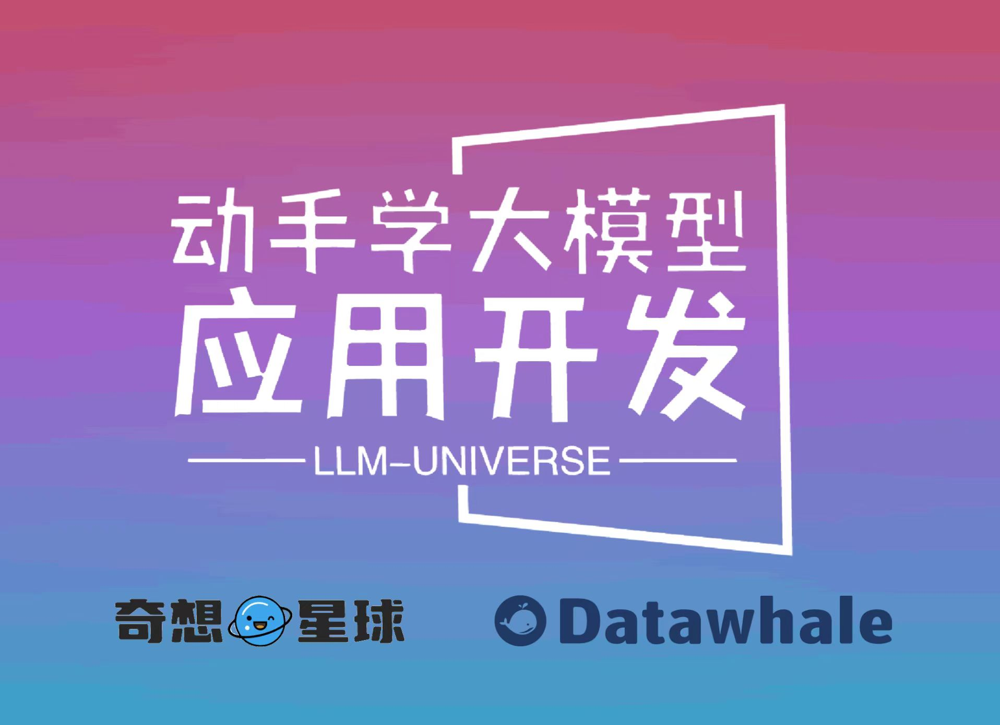

# 动手学大模型应用开发

## 项目简介

本项目是一个面向小白开发者的大模型应用开发教程，旨在基于阿里云服务器，结合个人知识库助手项目，通过一个课程完成大模型开发的重点入门，主要内容包括：

1. 大模型简介，何为大模型、大模型特点是什么、LangChain 是什么，如何开发一个 LLM 应用，针对小白开发者的简单介绍；
2. 如何调用大模型 API，本节介绍了国内外知名大模型产品 API 的多种调用方式，包括调用原生 API、封装为 LangChain LLM、封装为 Fastapi 等调用方式，同时将包括百度文心、讯飞星火、智谱AI等多种大模型 API 进行了统一形式封装；
3. 知识库搭建，不同类型知识库文档的加载、处理，向量数据库的搭建；
4. 构建 RAG 应用，包括将 LLM 接入到 LangChain 构建检索问答链，使用 Streamlit 进行应用部署
5. 验证迭代，大模型开发如何实现验证迭代，一般的评估方法有什么；

本项目主要包括三部分内容：

1. LLM 开发入门。V1 版本的简化版，旨在帮助初学者最快、最便捷地入门 LLM 开发，理解 LLM 开发的一般流程，可以搭建出一个简单的 Demo。
2. LLM 开发技巧。LLM 开发更进阶的技巧，包括但不限于：Prompt Engineering、多类型源数据的处理、优化检索、召回精排、Agent 框架等
3. LLM 应用实例。引入一些成功的开源案例，从本课程的角度出发，解析这些应用范例的 Idea、核心思路、实现框架，帮助初学者明白其可以通过 LLM 开发什么样的应用。

第一部分已完稿；第二部分的 C7 高级 RAG 技巧已提供七步学习路径、可运行 Notebook 与评估案例，可以从[课程入口](https://github.com/datawhalechina/llm-universe/blob/main/notebook/C7%20高级%20RAG%20技巧/README.md)开始。第三部分持续补充应用解读。

**目录结构说明：**

      requirements.txt：官方环境下的安装依赖
      requirements_windows: Windows 环境下的安装依赖
      notebook：Notebook 源代码文件
      docs：Markdown 文档文件
      figures：图片
      data_base：所使用的知识库源文件

## 项目意义

LLM 正逐步成为信息世界的新革命力量，其通过强大的自然语言理解、自然语言生成能力，为开发者提供了新的、更强大的应用开发选择。随着国内外井喷式的 LLM API 服务开放，如何基于 LLM API 快速、便捷地开发具备更强能力、集成 LLM 的应用，开始成为开发者的一项重要技能。

目前，关于 LLM 的介绍以及零散的 LLM 开发技能课程已有不少，但质量参差不齐，且没有很好地整合，开发者需要搜索大量教程并阅读大量相关性不强、必要性较低的内容，才能初步掌握大模型开发的必备技能，学习效率低，学习门槛也较高。

本项目从实践出发，结合最常见、通用的个人知识库助手项目，深入浅出逐步拆解 LLM 开发的一般流程、步骤，旨在帮助没有算法基础的小白通过一个课程完成大模型开发的基础入门。同时，我们也会加入 RAG 开发的进阶技巧以及一些成功的 LLM 应用案例的解读，帮助完成第一部分学习的读者进一步掌握更高阶的 RAG 开发技巧，并能够通过对已有成功项目的借鉴开发自己的、好玩的应用。

## 项目受众

所有具备基础 Python 能力，想要掌握 LLM 应用开发技能的开发者。

**本项目对学习者的人工智能基础、算法基础没有任何要求，仅需要掌握基本 Python 语法、掌握初级 Python 开发技能即可。**

考虑到环境搭建问题，本项目提供了阿里云服务器学生免费领取方式，学生读者可以免费领取阿里云服务器，并通过阿里云服务器完成本课程的学习；本项目同时也提供了个人电脑及非阿里云服务器的环境搭建指南；本项目对本地硬件基本没有要求，不需要 GPU 环境，个人电脑及服务器均可用于学习。

**注：本项目主要使用各大模型厂商提供的 API 来进行应用开发，如果你想要学习部署应用本地开源 LLM，欢迎学习同样由 Datawhale 出品的 [Self LLM ｜ 开源大模型食用指南](https://github.com/datawhalechina/self-llm)，该项目将手把手教你如何速通开源 LLM 部署微调全链路！**

**注：考虑到学习难度，本项目主要面向初学者，介绍如何使用 LLM 来搭建应用。如果你想要进一步深入学习 LLM 的理论基础，并在理论的基础上进一步认识、应用 LLM，欢迎学习同样由 Datawhale 出品的 [So Large LM | 大模型基础](https://github.com/datawhalechina/so-large-lm)，该项目将为你提供全面而深入的 LLM 理论知识及实践方法！**

## 项目亮点

1. 充分面向实践，动手学习大模型开发。相较于其他从理论入手、与实践代差较大的类似教程，本教程基于具有通用性的个人知识库助手项目打造，将普适的大模型开发理念融合在项目实践中，帮助学习者通过动手搭建个人项目来掌握大模型开发技能。

2. 从零开始，全面又简短的大模型教程。本项目针对个人知识库助手项目，对相关大模型开发理论、概念和基本技能进行了项目主导的重构，删去不需要理解的底层原理和算法细节，涵盖所有大模型开发的核心技能。教程整体时长在数小时之内，但学习完本教程，可以掌握基础大模型开发的所有核心技能。

3. 兼具统一性与拓展性。本项目对 GPT、百度文心、讯飞星火、智谱GLM 等国内外主要 LLM API 进行了统一封装，支持一键调用不同的 LLM，帮助开发者将更多的精力放在学习应用与模型本身的优化上，而不需要花时间在繁琐的调用细节上；同时，本教程拟上线 [奇想星球 | AIGC共创社区平台](https://1aigc.cn/)，支持学习者自定义项目为本教程增加拓展内容，具备充分的拓展性。

## 在线阅读地址

[LLM Universe V2](https://datawhalechina.github.io/llm-universe/#/)

## 内容大纲

### 第一部分 LLM 开发入门 

负责人：邹雨衡

1. LLM 介绍 @高立业
   1. LLM 的理论介绍
   2. 什么是 RAG，RAG 的核心优势
   3. 什么是 LangChain 
   4. 开发 LLM 应用的整体流程
   5. 阿里云服务器的基本使用
   6. 环境配置
2. 使用 LLM API 开发应用 @毛雨
   1. 使用 LLM API
        - ChatGPT
        - 文心一言
        - 讯飞星火
        - 智谱 GLM
   2. Prompt Engineering
3. 搭建知识库 @娄天奥
   1. 词向量及向量知识库介绍
   2. 使用 Embedding API
   3. 数据处理：读取、清洗与切片
   4. 搭建并使用向量数据库
4. 构建 RAG 应用 @徐虎
   1. 将 LLM 接入 LangChain
        - ChatGPT
        - 文心一言
        - 讯飞星火
        - 智谱 GLM
   2. 基于 LangChain 搭建检索问答链
   3. 基于 Streamlit 部署知识库助手
5. 系统评估与优化 @邹雨衡
   1. 如何评估 LLM 应用
   2. 评估并优化生成部分
   3. 评估并优化检索部分

### 第二部分 进阶 RAG 技巧

完整课程入口：[C7 高级 RAG 技巧](https://github.com/datawhalechina/llm-universe/blob/main/notebook/C7%20高级%20RAG%20技巧/README.md)。C7 的 Notebook 源文件位于仓库 `notebook/` 目录，以下入口在 GitHub 打开；本地运行环境与依赖以 C7 首页为准。

负责人：高立业

1. 背景：为什么基础 RAG 还会答错，以及怎样区分资料、检索和回答问题。
2. 数据处理：读取和清理资料、比较分块方式、选择向量模型，以及判断何时需要微调。
3. 索引阶段：保存资料属性，为片段补充背景和检索说法，并结合关键词与向量检索。
4. 检索阶段：提取筛选条件、过滤无权资料、改写问题、判断是否继续检索，以及让检索器适应回答模型。
5. 生成阶段：排序、压缩候选资料、核对原文和处理资料不足时的回答。
6. 处理信息缺口：补回相邻上下文、补查遗漏内容、拆分复杂问题、检查资料后继续，以及选择资料来源。
7. 评估：选择问题、比较改动前后、分开检查问题与资料、计算指标、建设问题集和持续观察结果。

C7 题集的分布边界也需要明确：当前 canonical 数据包保留 163 条 query→evidence pair（101 train、28 dev、34 frozen test），分别覆盖 55、14、17 个互不重叠的 PDF 页面。问法由 `glm-4-flash` 生成和初审，再经独立模型语义复核；110 条二次复核剔除记录及理由单独留档，全部保留记录均标为 `human_verified=false`。它们是合成问法，不是自然独立用户样本；相关结论只适用于这组有限分布。C2 的真实微调在 frozen test 上逐题表现为 9 条改善、3 条退化、22 条不变，不能外推为自然用户集覆盖。

### 第三部分 开源 LLM 应用解读

负责人：徐虎

1. ChatWithDatawhale——个人知识库助手解读
2. 天机——人情世故大模型解读

## 致谢

**核心贡献者**

- [邹雨衡-项目负责人](https://github.com/logan-zou)（Datawhale成员-对外经济贸易大学研究生）
- [高立业-第二部分负责人](https://github.com/0-yy-0)（DataWhale成员-算法工程师）
- [徐虎-第三部分负责人](https://github.com/xuhu0115)（Datawhale成员-算法工程师）

**主要贡献者**

- [毛雨-内容创作者](https://github.com/Myoungs )（后端开发工程师）
- [娄天奥-内容创作者](https://github.com/lta155)（Datawhale鲸英助教-中国科学院大学研究生）
- [崔腾松-项目支持者](https://github.com/2951121599)（Datawhale成员-奇想星球联合发起人）
- [June-项目支持者](https://github.com/JuneYaooo)（Datawhale成员-奇想星球联合发起人）

**其他**

1. 特别感谢 [@Sm1les](https://github.com/Sm1les)、[@LSGOMYP](https://github.com/LSGOMYP) 对本项目的帮助与支持；
2. 特别感谢[奇想星球 | AIGC共创社区平台](https://1aigc.cn/)提供的支持，欢迎大家关注；
3. 如果有任何想法可以联系我们 DataWhale 也欢迎大家多多提出 issue；
4. 特别感谢以下为教程做出贡献的同学！

Made with [contrib.rocks](https://contrib.rocks).

## Star History

