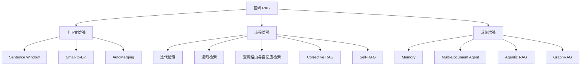
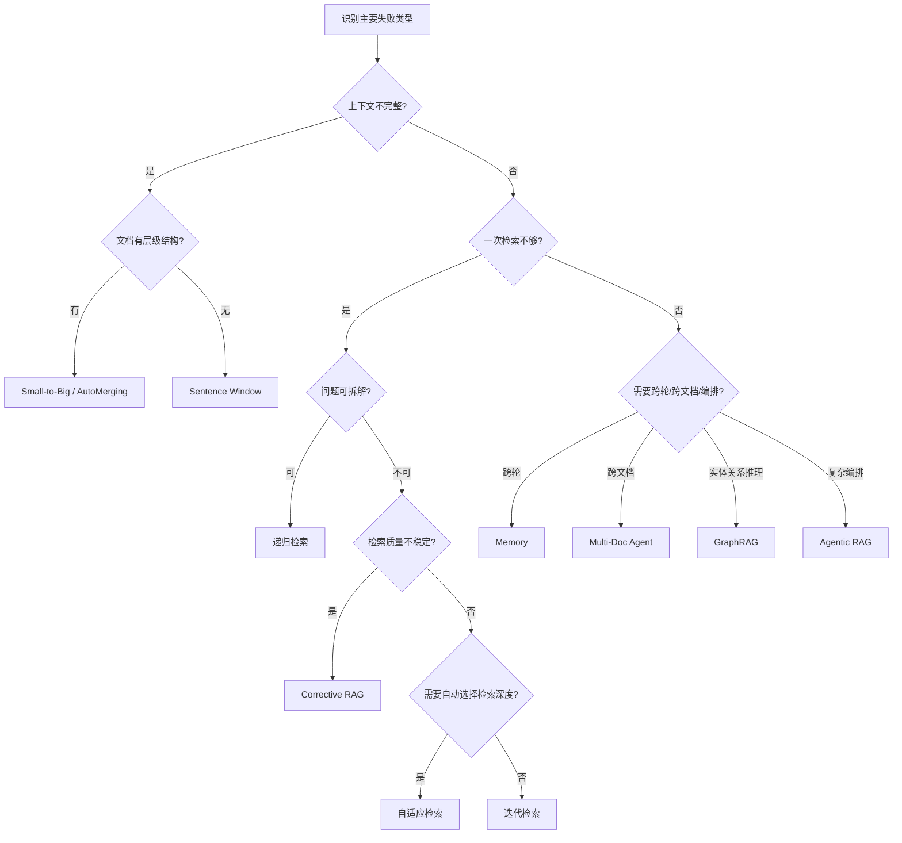

# 增强阶段 2026 更新 Implementation Plan

> **For Claude:** REQUIRED SUB-SKILL: Use superpowers:executing-plans to implement this plan task-by-task.

**Goal:** 补充 2025-2026 RAG 新技术、修复现有缺陷、同步导航与选型文档，使第 6 章增强阶段成为 2026 年完整教程。

**Architecture:** 在现有"三层增强 + 选型总结"骨架上做增量修改：上下文增强加引导语和 Late Chunking 理论；流程增强扩展查询路由为自适应检索；系统增强修复多城市路由、增强 Agentic RAG、新增轻量 GraphRAG；第 3 章 CCH 末尾补 Contextual Retrieval；最后同步先导、选型总结、readme。

**Tech Stack:** LangChain (langchain-openai, langchain-community), Chroma, Python dict（图模拟）

---

### Task 1: 上下文增强 — 如何选择加引导语

**Files:**
- Modify: `notebook/C7 高级 RAG 技巧/6. 增强阶段/1. 上下文增强（重构版）.ipynb` Cell 13

**Step 1: 编辑 Cell 13**

在现有"如何选择"内容末尾追加一段：

```markdown
- 如果问题出在 chunk 本身缺少文档语境（脱离上下文后语义不完整），这属于**索引阶段**优化，应回到第 3 章的 CCH / Contextual Retrieval。本章的上下文增强解决的是"检索后恢复邻域"，而非"索引时缺少语境"。
```

**Step 2: 验证**

在 IDE 中确认 Cell 13 内容正确显示。

---

### Task 2: 上下文增强 — Late Chunking 理论介绍

**Files:**
- Modify: `notebook/C7 高级 RAG 技巧/6. 增强阶段/1. 上下文增强（重构版）.ipynb`，在 Cell 12（最终对比表）之后插入新 cell

**Step 1: 在 Cell 12 之后插入新 markdown cell**

内容：

```markdown
## 前沿方法：Late Chunking（理论介绍）

### 传统流程的问题
传统 RAG 的流程是"先切分，再分别嵌入"——每个 chunk 独立通过 embedding 模型，丢失了跨 chunk 的语义关联。

### Late Chunking 思路
Late Chunking 颠倒了这个顺序：
1. 先将**整个文档**送入长上下文 embedding 模型（如 jina-embeddings-v2），获得每个 token 的上下文化表示
2. 再按预设边界切分 token embeddings，对每个 chunk 的 token embeddings 做池化得到 chunk embedding

这样每个 chunk 的向量都"见过"完整文档上下文，天然缓解了上下文割裂问题。

### 与本章方法的对比

| 维度 | Sentence Window / Small-to-Big / AutoMerging | Late Chunking |
|---|---|---|
| 增强时机 | 检索时（命中后恢复邻域） | 索引时（embedding 阶段） |
| 额外存储 | 需要维护邻居映射 / 父子关系 | 不需要 |
| 模型依赖 | 无特殊要求 | 需要长上下文 embedding 模型 |
| 实现复杂度 | 中 | 低（但模型选择受限） |

### 局限
- 依赖支持长上下文的 embedding 模型（如 jina-embeddings-v2、nomic-embed），OpenAI text-embedding-3 系列不直接支持此模式
- 文档超过模型上下文窗口时需要分段处理
- 目前 LangChain 生态无开箱即用的 Late Chunking 组件

### 本节为什么不做代码示例
Late Chunking 需要特殊的 embedding 模型和自定义 tokenizer 操作，与本教程统一使用 OpenAI embedding 的约定不兼容。此处仅作概念介绍，帮助读者建立"还有一类索引时上下文增强"的认知。
```

**Step 2: 验证**

确认新 cell 在对比表和"如何选择"之间正确显示。

---

### Task 3: 上下文增强 — 更新对比表

**Files:**
- Modify: `notebook/C7 高级 RAG 技巧/6. 增强阶段/1. 上下文增强（重构版）.ipynb` Cell 12

**Step 1: 编辑 Cell 12 对比表**

在表尾追加一行：

```markdown
| Late Chunking（理论） | embedding 缺少文档全局信息 | 低（但模型受限） | 需长上下文 embedding 模型 |
```

**Step 2: 验证**

确认表格渲染正确。

---

### Task 4: 流程增强 — 查询路由扩展为自适应检索

**Files:**
- Modify: `notebook/C7 高级 RAG 技巧/6. 增强阶段/2. 流程增强（重构版）.ipynb` Cell 10, Cell 11, Cell 5

**Step 1: 修改 Cell 10 标题**

将：
```markdown
## 查询路由（Query Routing）
```
改为：
```markdown
## 查询路由与自适应检索（Query Routing & Adaptive Retrieval）
```

追加内容：
```markdown
查询路由解决"走哪条检索链路"，自适应检索解决"走多深"。两者都是检索前的策略决策，放在一起形成完整的"检索前决策层"。
```

**Step 2: 在 Cell 11 代码末尾追加自适应检索代码**

在现有路由代码之后追加：

```python
# === 自适应检索：根据 query 复杂度决定检索深度 ===

def classify_query_complexity(query: str) -> str:
    prompt = f"""
判断以下问题的复杂度，只输出 simple / moderate / complex 之一。
- simple: 单一事实查询，一次检索即可回答
- moderate: 需要多个证据片段，可能需要补充检索
- complex: 需要多步推理、子问题拆解或跨文档整合

问题：{query}
"""
    return llm.invoke(prompt).content.strip().lower()

def adaptive_retrieval_answer(query: str) -> str:
    complexity = classify_query_complexity(query)

    if complexity == "simple":
        docs_ = retriever.invoke(query)
        ctx = "\n\n".join(d.page_content for d in docs_)
        answer = llm.invoke(f"问题：{query}\n上下文：\n{ctx}\n请回答。").content
    elif complexity == "moderate":
        answer = iterative_retrieval(query, max_rounds=2)
    else:
        sub_qs = [
            f"关于'{query}'的核心概念是什么？",
            f"关于'{query}'的关键证据有哪些？",
            f"关于'{query}'的结论或建议是什么？",
        ]
        _, answer = recursive_retrieval(query, sub_qs)

    return complexity, answer

# 测试不同复杂度的问题
test_queries = [
    "什么是SVM？",
    "请归纳文档的核心矛盾，再给出改进路径。",
]
for tq in test_queries:
    comp, ans = adaptive_retrieval_answer(tq)
    print(f"query: {tq}")
    print(f"complexity: {comp}")
    print(f"answer: {ans[:200]}\n")
```

**Step 3: 更新 Cell 5 分类表**

在五种方法表尾追加一行：
```markdown
| 自适应检索 | 选深度型 | "这个问题有多复杂？" -> 选择检索策略 |
```

**Step 4: 验证**

确认代码 cell 语法正确，分类表渲染正常。

---

### Task 5: 流程增强 — 更新小结

**Files:**
- Modify: `notebook/C7 高级 RAG 技巧/6. 增强阶段/2. 流程增强（重构版）.ipynb` Cell 16

**Step 1: 编辑 Cell 16**

在小结列表末尾追加：
```markdown
- `自适应检索`：适合需要根据问题复杂度自动选择检索深度的场景，与查询路由配合使用。
```

在学习检查点追加：
```markdown
- 你能解释查询路由（选方向）和自适应检索（选深度）的区别吗？
```

**Step 2: 验证**

确认内容显示正确。

---

### Task 6: 系统增强 — 修复多城市路由

**Files:**
- Modify: `notebook/C7 高级 RAG 技巧/6. 增强阶段/3. 系统增强.ipynb` Cell 7

**Step 1: 替换 Cell 7 代码**

将现有 `route_city` 和 `ask_multi_doc_agent` 替换为：

```python
def route_cities(query: str) -> list[str]:
    matched = [city for city in wiki_titles if city.lower() in query.lower()]
    if matched:
        return matched

    judge_prompt = f"""
从以下城市中选择与问题最相关的城市（可多选），用逗号分隔：{wiki_titles}
问题：{query}
只输出城市名，用逗号分隔。
"""
    raw = llm.invoke(judge_prompt).content.strip()
    cities = [c.strip() for c in raw.split(",") if c.strip() in wiki_titles]
    return cities if cities else ["Boston"]

def ask_multi_doc_agent(query: str) -> str:
    cities = route_cities(query)
    all_ctx = []
    for city in cities:
        docs = city_retrievers[city].invoke(query)
        all_ctx.extend(d.page_content for d in docs)
    ctx = "\n\n".join(all_ctx[:8])
    prompt = f"你是{'/'.join(cities)}领域助手。问题：{query}\n上下文：\n{ctx}\n请回答。"
    return cities, llm.invoke(prompt).content

response_cities, response = ask_multi_doc_agent("Tell me about the arts and culture in Boston")
print("route cities:", response_cities)
print(response[:260])
```

**Step 2: 验证**

确认单城市和多城市 query 都能正常路由。

---

### Task 7: 系统增强 — 增强 Agentic RAG

**Files:**
- Modify: `notebook/C7 高级 RAG 技巧/6. 增强阶段/3. 系统增强.ipynb` Cell 13

**Step 1: 替换 Cell 13 代码**

```python
def planner(question: str) -> list[str]:
    plan_prompt = f"""
将问题拆成 2-3 个可独立检索的执行步骤。
每个步骤应是一个具体的检索问题，而非抽象描述。
只输出 Python 列表字符串。

问题：{question}
"""
    raw = llm.invoke(plan_prompt).content
    if '[' in raw and ']' in raw:
        try:
            return eval(raw)
        except Exception:
            pass
    return [f"查找关于 {question} 的关键事实", f"比较并生成关于 {question} 的结论"]

def executor(step: str) -> str:
    cities, ans = ask_multi_doc_agent(step)
    return f"[{step}] route={cities}\n{ans[:300]}"

def reflector(question: str, outputs: list[str]) -> tuple[str, list[str]]:
    review_prompt = f"""
原始问题：{question}
已有执行结果：
{chr(10).join(outputs)}

判断这些结果是否足够回答原始问题。
如果足够，输出：sufficient
如果不够，输出：insufficient: <需要补充检索的问题>
"""
    result = llm.invoke(review_prompt).content.strip()
    if "insufficient" in result.lower():
        extra = result.split(":")[-1].strip()
        return "insufficient", [extra] if extra else []
    return "sufficient", []

def agentic_rag(question: str, max_reflect: int = 2):
    steps = planner(question)
    outputs = [executor(step) for step in steps]

    for _ in range(max_reflect):
        decision, extra_steps = reflector(question, outputs)
        if decision == "sufficient" or not extra_steps:
            break
        for es in extra_steps:
            outputs.append(executor(es))
            steps.append(es)

    final = llm.invoke(f"问题：{question}\n中间结果：{outputs}\n请给出最终完整回答。").content
    return steps, outputs, final

agent_query = "Compare Boston and Houston in arts and demographics."
steps, outputs, agentic_answer = agentic_rag(agent_query)
non_agent_cities, non_agent_answer = ask_multi_doc_agent(agent_query)

print('steps:', steps)
print('\n=== Agentic RAG ===')
print(agentic_answer[:320])
print('\n=== Non-agent workflow ===')
print(f'route={non_agent_cities}')
print(non_agent_answer[:320])
```

**Step 2: 验证**

确认 planner 输出的 steps 是具体检索问题，executor 按 step 独立路由。

---

### Task 8: 系统增强 — 新增 GraphRAG 轻量介绍

**Files:**
- Modify: `notebook/C7 高级 RAG 技巧/6. 增强阶段/3. 系统增强.ipynb`，在 Cell 14 之后插入 2 个新 cell

**Step 1: 插入 markdown cell**

```markdown
## GraphRAG（轻量介绍）

### 向量检索 vs 图检索
- 向量检索：找"语义相似的文本片段"——适合局部事实查询
- 图检索：找"实体之间的关系路径"——适合全局性问题（"文档整体讲了什么"）和多跳推理（A→B→C）

### 核心流程
1. **实体与关系提取**：用 LLM 从文档中抽取 `(实体, 关系, 实体)` 三元组
2. **知识图谱构建**：将三元组存入图结构
3. **基于图的检索**：给定 query，先提取 query 中的实体，再在图中查找相关三元组作为上下文

### 适用场景
- 问题需要跨段落的实体关系推理（如"A 和 B 有什么联系"）
- 需要文档级全局摘要（如"这篇论文的核心贡献是什么"）
- 多文档间的实体对齐与关系发现

### 局限
- 实体提取质量依赖 LLM，噪声较大
- 图构建成本高（需要遍历所有文档）
- 生产环境通常需要 Neo4j 等图数据库，本节仅用 Python dict 做教学演示

### 与系统增强其他方法的关系
- Multi-Document Agent 按文档路由 → GraphRAG 按实体关系路由
- Agentic RAG 做任务规划 → GraphRAG 可作为其中一个工具
```

**Step 2: 插入代码 cell**

```python
# GraphRAG 最小教学示例：纯 dict 实现

from langchain_community.document_loaders import TextLoader

city_text = TextLoader(str(DATA_DIR / "Boston.txt"), encoding="utf-8").load()[0].page_content[:2000]

# Step 1: 用 LLM 提取三元组
extract_prompt = f"""
从以下文本中提取实体和关系，输出为 Python 列表格式：
[("实体1", "关系", "实体2"), ...]

要求：
- 每个三元组都是 (主语, 谓语/关系, 宾语)
- 提取 5-10 个最重要的三元组
- 只输出列表，不要其他内容

文本：
{city_text[:1500]}
"""

raw_triples = llm.invoke(extract_prompt).content
try:
    triples = eval(raw_triples)
except Exception:
    triples = [("Boston", "is_a", "city"), ("Boston", "known_for", "education")]

print(f"提取到 {len(triples)} 个三元组：")
for t in triples[:5]:
    print(f"  {t}")

# Step 2: 构建图（纯 dict）
graph = {}
for subj, rel, obj in triples:
    graph.setdefault(subj, []).append((rel, obj))
    graph.setdefault(obj, []).append((rel + "_by", subj))

# Step 3: 基于图的检索
def graph_retrieve(query: str, graph: dict, top_k: int = 5) -> str:
    entity_prompt = f"从问题中提取关键实体，用逗号分隔，只输出实体名。问题：{query}"
    entities = [e.strip() for e in llm.invoke(entity_prompt).content.split(",")]

    relevant_triples = []
    for entity in entities:
        for node, edges in graph.items():
            if entity.lower() in node.lower():
                for rel, target in edges:
                    relevant_triples.append(f"{node} --{rel}--> {target}")

    return "\n".join(relevant_triples[:top_k]) if relevant_triples else "未找到相关实体关系"

# 测试
test_q = "What is Boston known for in education?"
graph_context = graph_retrieve(test_q, graph)
print(f"\n图检索结果：\n{graph_context}")

graph_answer = llm.invoke(f"问题：{test_q}\n图谱证据：\n{graph_context}\n请回答。").content
print(f"\nGraphRAG 回答：\n{graph_answer[:300]}")

# 与向量检索对比
vector_docs = city_retrievers["Boston"].invoke(test_q)
vector_ctx = "\n\n".join(d.page_content for d in vector_docs)
vector_answer = llm.invoke(f"问题：{test_q}\n上下文：\n{vector_ctx}\n请回答。").content
print(f"\n向量检索回答：\n{vector_answer[:300]}")
```

**Step 3: 验证**

确认三元组提取和图检索能正常运行。

---

### Task 9: 先导 — 更新导航表和方法地图

**Files:**
- Modify: `notebook/C7 高级 RAG 技巧/6. 增强阶段/0. 先导：为什么基础 RAG 还不够.ipynb` Cell 12, Cell 13

**Step 1: 修改 Cell 12 导航表**

替换为：

```markdown
## 本章导航

| 失败类型 | 代表案例 | 解法所在 | 核心方法 |
|---|---|---|---|
| 检索相关但上下文不全 | 案例 1 | 1. 上下文增强 | Sentence Window / Small-to-Big / AutoMerging |
| 一次检索+一次生成不够 | 案例 2 | 2. 流程增强 | 迭代检索 / 递归检索 / CRAG / Self-RAG / 自适应检索 |
| 多轮/多文档/状态丢失 | 案例 3 | 3. 系统增强 | Memory / Multi-Doc Agent / Agentic RAG / GraphRAG |
```

**Step 2: 修改 Cell 13 方法地图**

替换 mermaid 图为：

````markdown
## 方法地图


````

**Step 3: 验证**

确认表格和 mermaid 图正确渲染。

---

### Task 10: 选型总结 — 全面更新

**Files:**
- Modify: `notebook/C7 高级 RAG 技巧/6. 增强阶段/4. 选型总结.md`

**Step 1: 更新决策流程图**

替换 mermaid 图为：

````markdown

````

**Step 2: 更新速查表**

在现有 Agentic RAG 行后追加：

```markdown
| 自适应检索 | 需要按复杂度选策略 | 策略匹配度、端到端效率 | 中 | 中 | 与查询路由配合 |
| GraphRAG | 需要实体关系推理 | 多跳准确率、全局覆盖度 | 高 | 高 | 知识密集场景 |
```

**Step 3: 更新推荐组合**

在现有第 3 组后追加：

```markdown
4. **知识密集组合**：`GraphRAG + Corrective RAG + 自适应检索`
   目标：处理需要实体关系推理的复杂知识问答；按 query 复杂度动态调整策略。
```

**Step 4: 追加误区**

在误区 3 后追加：

```markdown
- 误区 4：用 GraphRAG 替代向量检索。
  GraphRAG 擅长全局性和关系型问题，但对局部事实查询效率不如向量检索。两者互补，不是替代关系。
```

**Step 5: 验证**

确认 markdown 渲染正确。

---

### Task 11: readme — 同步方法列表

**Files:**
- Modify: `notebook/C7 高级 RAG 技巧/6. 增强阶段/readme.md`

**Step 1: 更新方法列表**

替换"本章新增方法（2026）"部分为：

```markdown
## 本章新增方法（2026）

- 上下文增强：`Sentence Window`、`Small-to-Big`、`AutoMerging`、`Late Chunking（理论）`
- 流程增强：`迭代检索`、`递归检索`、`查询路由与自适应检索`、`Corrective RAG`、`Self-RAG`
- 系统增强：`Memory`、`Multi-Document Agent`、`Agentic RAG`、`GraphRAG`
```

**Step 2: 验证**

确认 readme 内容正确。

---

### Task 12: 第 3 章 CCH — 新增 Contextual Retrieval 节

**Files:**
- Modify: `notebook/C7 高级 RAG 技巧/3. 索引阶段/3.CCH_Contextual_Chunk_Headers.ipynb`，在最后一个 cell 之后插入 3 个新 cell

**Step 1: 插入 markdown cell — 理论介绍**

```markdown
## 三、从 CCH 到 Contextual Retrieval

### CCH 的局限
CCH 为每个 chunk 生成的是**文档级标题**（一句话），所有 chunk 可能共享相同或相似的 header。这对于区分同一文档内不同 chunk 的作用有限。

### Contextual Retrieval（Anthropic, 2024）
Contextual Retrieval 的核心改进是：为每个 chunk 生成**独立的上下文摘要前缀**，描述该 chunk 在文档中的具体位置和角色。

| 维度 | CCH | Contextual Retrieval |
|---|---|---|
| 生成粒度 | 文档级标题（所有 chunk 共享） | chunk 级上下文（每个 chunk 独立） |
| 生成内容 | "这篇文档讲的是 X" | "这个 chunk 位于第 Y 节，讨论了 Z 在 W 背景下的应用" |
| LLM 调用次数 | 1 次（或按文档） | 每个 chunk 1 次 |
| 检索提升 | 中等（减少跨文档混淆） | 显著（减少同文档内 chunk 混淆） |
| 成本 | 低 | 中-高（可通过缓存优化） |

### Prompt 设计关键
Contextual Retrieval 的 prompt 需要同时传入**完整文档**和**当前 chunk**，让 LLM 生成该 chunk 的定位描述。
```

**Step 2: 插入代码 cell**

```python
# Contextual Retrieval 实现：为每个 chunk 生成独立上下文前缀

from langchain_openai import ChatOpenAI

llm_ctx = ChatOpenAI(model="gpt-4o-mini", temperature=0)

CONTEXT_PROMPT = """
以下是一篇完整文档：
<document>
{doc_text}
</document>

以下是文档中的一个片段：
<chunk>
{chunk_text}
</chunk>

请用 1-2 句话简要描述这个片段在文档中的位置和角色。不要重复片段内容，只描述上下文定位。
"""

def generate_chunk_context(doc_text: str, chunk_text: str) -> str:
    prompt = CONTEXT_PROMPT.format(
        doc_text=doc_text[:3000],
        chunk_text=chunk_text,
    )
    return llm_ctx.invoke(prompt).content.strip()

# 对前 3 个 chunk 做演示
sample_chunks = split_docs_wo_cch[:3]
full_doc_text = "\n".join(page.page_content for page in data_pages[:5])

print("=== Contextual Retrieval 示例 ===\n")
for i, chunk in enumerate(sample_chunks):
    ctx_prefix = generate_chunk_context(full_doc_text, chunk.page_content)
    print(f"[Chunk {i+1}]")
    print(f"  原始内容: {chunk.page_content[:80]}...")
    print(f"  上下文前缀: {ctx_prefix}")
    print(f"  增强后: {ctx_prefix} | {chunk.page_content[:80]}...\n")
```

**Step 3: 插入 markdown cell — 总结**

```markdown
### 选择建议

- 如果你的 chunk 跨文档混淆严重（不同文档的 chunk 检索时串扰）：先用 **CCH**，成本低见效快。
- 如果同一文档内的 chunk 互相混淆（检索命中了同文档但错误位置的 chunk）：升级到 **Contextual Retrieval**。
- 两者可以叠加使用：先 CCH 加文档标题，再 Contextual Retrieval 加 chunk 级定位。

> 注意：Contextual Retrieval 的 LLM 调用成本与 chunk 数量成正比。对于大规模文档，建议使用带缓存的批量处理（如 Anthropic 的 prompt caching）来降低成本。
```

**Step 4: 验证**

确认新增 cell 在 CCH notebook 末尾正确显示，代码依赖的变量（`split_docs_wo_cch`, `data_pages`）在之前的 cell 中已定义。

---

设计文档和实施计划已保存。

**Plan complete and saved to `docs/plans/2026-03-15-chapter6-2026-update-implementation.md`。两种执行方式：**

**1. Subagent-Driven（本会话）** — 我逐个 Task 派发子代理执行，每个 Task 之间做代码审查

**2. Parallel Session（新会话）** — 打开新会话用 executing-plans 批量执行

**你选哪种？**