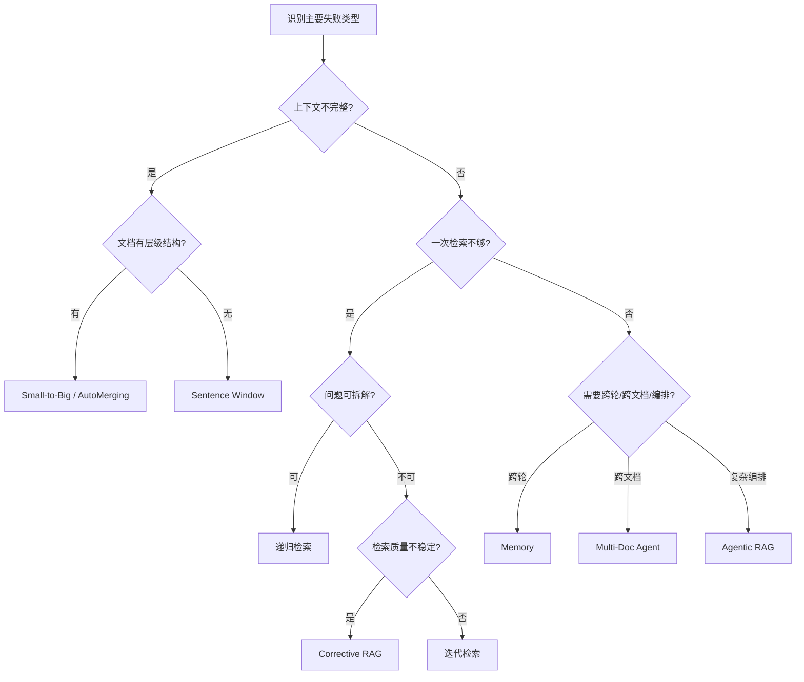

# Chapter 6 Enhancement Polish Design

> 基于 2026-03-15 第一轮重构完成后的优化设计。目标：收敛而非发散。

## 背景

第一轮重构（`2026-03-15-chapter6-implementation.md`）已完成 10 个 Task：
- 4 个 notebook 从 LlamaIndex pack 依赖切换到 LangChain 可运行实现
- 新增 Corrective RAG、Self-RAG、Agentic RAG 教学块
- 统一模型为 `gpt-4o-mini`
- 补齐选型总结与 readme

现存问题（brainstorming 审查结论）：
1. `0. 先导` 有 30 个 cell，其中约 15 个是重建过程中的重复残留
2. 4 个 notebook 的 setup cell 风格不统一（变量名、import 顺序、注释风格）
3. `2. 流程增强` 缺少方法间的分类对比和决策点描述
4. `3. 系统增强` 没有明确"流程 vs 系统"的边界
5. `4. 选型总结` 缺少可视化决策流程图

## 设计原则

- **不加新方法、不改教学主线**——只做收敛
- **每个改动都有明确的"改前 vs 改后"标准**
- **改完即最终版**——不留"下一轮再优化"的尾巴

## 5 项改动

### 改动 1：清理 `0. 先导` 重复 cell + 加分流语与导航表

**问题：** notebook 有 30 个 cell，cell 15-29 是第一轮重建时残留的旧内容副本。

**改动：**
1. 删除 cell 15-29（重复的标题、假设、setup、失败案例）
2. 每个失败案例分析 cell 末尾加一句分流语，格式为：
   `→ 解法详见 1. 上下文增强（重构版）`
3. 在"学习路径" cell 前插入一个导航表 markdown cell：

```markdown
| 失败类型 | 代表案例 | 解法所在 | 核心方法 |
|---|---|---|---|
| 检索相关但上下文不全 | 案例 1 | 1. 上下文增强 | Sentence Window / Small-to-Big / AutoMerging |
| 一次检索+一次生成不够 | 案例 2 | 2. 流程增强 | 迭代检索 / 递归检索 / CRAG / Self-RAG |
| 多轮/多文档/状态丢失 | 案例 3 | 3. 系统增强 | Memory / Multi-Doc Agent / Agentic RAG |
```

**验证：** cell 数量从 30 降至 ≤16；导航表存在。

### 改动 2：统一 4 个 notebook 的 setup cell 风格

**问题：** 每个 notebook 都独立写了一遍 import、load_dotenv、模型初始化，变量名和注释不一致。

**改动：**
统一 setup cell 为以下 pattern（各 notebook 只需改路径和数据加载）：

```python
from pathlib import Path
from dotenv import load_dotenv
from langchain_openai import ChatOpenAI, OpenAIEmbeddings
from langchain_text_splitters import RecursiveCharacterTextSplitter
from langchain_community.document_loaders import PyPDFLoader
from langchain_community.vectorstores import Chroma

load_dotenv()

MODEL_NAME = "gpt-4o-mini"
llm = ChatOpenAI(model=MODEL_NAME, temperature=0)
embeddings = OpenAIEmbeddings(model="text-embedding-3-small")
```

统一规范：
- import 顺序：stdlib → third-party → langchain
- 变量名：`MODEL_NAME`, `llm`, `embeddings`, `PDF_PATH`（先导/上下文）或 `DATA_DIR`（系统）
- 注释：只保留一句数据说明，删除冗余的 fallback 解释

**验证：** 4 个 notebook 的 setup cell 变量名一致；无 `gpt-3.5-turbo` 残留。

### 改动 3：`2. 流程增强` 补方法分类表 + 决策点描述

**问题：** 读者看完 5 个方法后缺少"这 5 个在流程控制维度上有什么差异"的总结。

**改动：**
1. 在 baseline 失败示例之后、第一个方法之前，加一个分类预告表：

```markdown
| 方法 | 流程控制类型 | 关键决策点 |
|---|---|---|
| 迭代检索 | 补检索型 | "还缺什么？" → 继续/停止 |
| 递归检索 | 拆任务型 | "该拆成哪些子问题？" |
| 查询路由 | 选路径型 | "走哪条检索链路？" |
| Corrective RAG | 控质量型 | "检索结果够好吗？" → 过滤/补检 |
| Self-RAG | 自反思型 | "回答够好吗？" → 继续检索/停止 |
```

2. 每个方法的 markdown cell 补 1 句决策点描述（如果已有则保持不变）

**验证：** 分类表存在；5 个方法 markdown 中都包含"决策点"或等价表述。

### 改动 4：`3. 系统增强` 补"流程 vs 系统"边界说明

**问题：** 读者从 `2. 流程增强` 跳到 `3. 系统增强` 时，不清楚为什么需要"升级"。

**改动：**
在 section goal cell 后面加一个 markdown cell：

```markdown
## 流程增强 vs 系统增强

流程增强关注"单次请求内"的多步决策（多轮检索、子问题拆解、质量把关）。

系统增强关注"跨请求"的工程问题：
- 上一轮对话的信息怎么延续？→ Memory
- 多个数据源怎么组织和路由？→ Multi-Document Agent
- 复杂任务怎么规划、执行、反思？→ Agentic RAG

判断标准：如果去掉 history / 去掉多文档路由 / 去掉任务规划，系统仍能回答，那是流程问题；否则是系统问题。
```

**验证：** "流程增强 vs 系统增强" 关键词存在于 `3. 系统增强.ipynb`。

### 改动 5：`4. 选型总结` 加 mermaid 决策流程图

**问题：** 速查表是静态的，读者需要一个"先判断什么 → 再判断什么"的决策路径。

**改动：**
在"1) 先判断问题类型"和"2) 方法选择速查表"之间插入：

```markdown
## 1.5) 方法选择决策流程


```

**验证：** `4. 选型总结.md` 中包含 mermaid flowchart 块。

## 不做的事情

- 不加更多小标题（9 级模板会让 notebook 过于碎片化）
- 不搞"系统框架六维图"（对初学者过于抽象）
- 不重写"推荐组合"（已经覆盖三档场景）
- 不改教学主线和方法选择
- 不新增方法

## 预期最终状态

- `0. 先导`：≤16 cell，每个案例有分流语，有导航表
- `1. 上下文增强`：不变，作为模板基准
- `2. 流程增强`：多一个分类表，每个方法有决策点
- `3. 系统增强`：多一个边界说明 cell
- `4. 选型总结`：多一个 mermaid 决策图
- 所有 notebook：setup cell 风格统一
