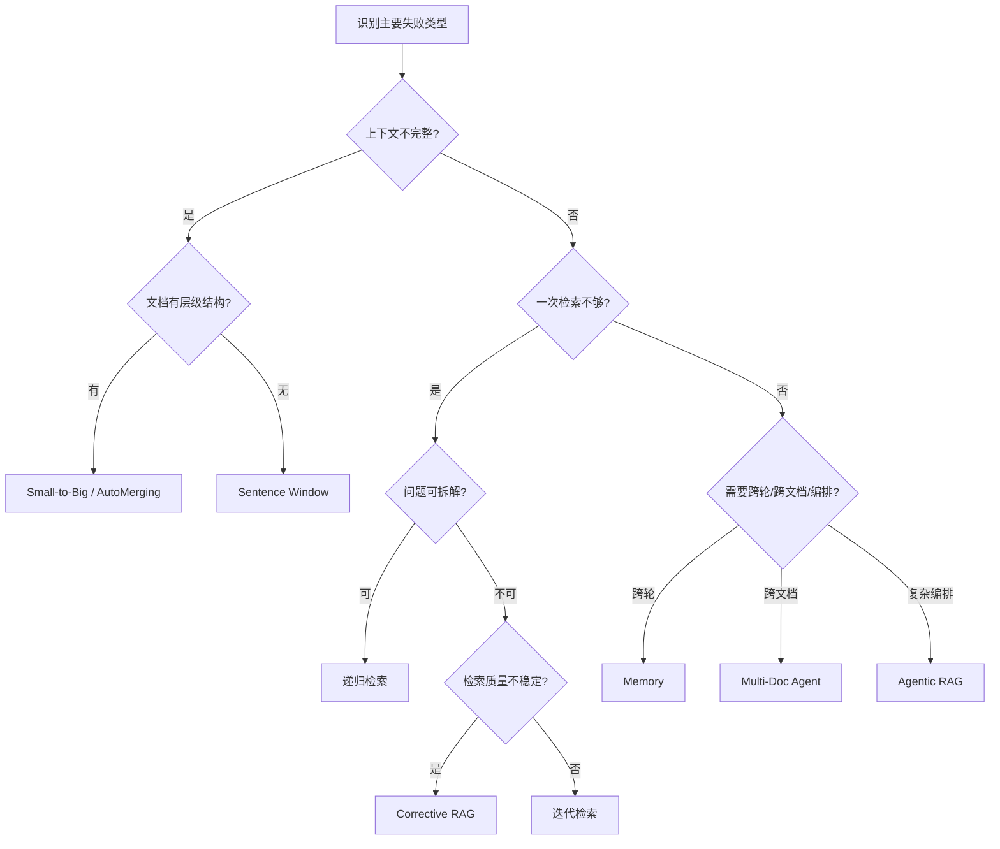

# Chapter 6 Polish Implementation Plan

> **For Claude:** REQUIRED SUB-SKILL: Use superpowers:executing-plans to implement this plan task-by-task.

**Goal:** 将第六章从"已重构完成"收敛为"教学模板统一、运行边界清楚、代码组织稳定"的最终版。

**Architecture:** 不加新方法，不改教学主线。5 项改动按文件分组为 5 个 Task，每个 Task 有明确的验证标准。

**Tech Stack:** Jupyter notebooks, Markdown, Python, mermaid.

---

### Task 1: 清理先导 notebook 重复 cell + 加分流语与导航表

**Files:**
- Modify: `notebook/C7 高级 RAG 技巧/6. 增强阶段/0. 先导：为什么基础 RAG 还不够.ipynb`

**Step 1: 删除 cell 15-29（重复残留）**

用 Python 脚本删除：
```bash
python - <<'PY'
import json
path = "notebook/C7 高级 RAG 技巧/6. 增强阶段/0. 先导：为什么基础 RAG 还不够.ipynb"
nb = json.load(open(path))
nb["cells"] = nb["cells"][:15]
json.dump(nb, open(path, "w"), ensure_ascii=False, indent=1)
print("cells after:", len(nb["cells"]))
PY
```

Expected: cells = 15

**Step 2: 给 3 个分析 cell 末尾加分流语**

- cell 5（案例 1 分析）末尾加：`\n\n→ 解法详见 **1. 上下文增强（重构版）**`
- cell 8（案例 2 分析）末尾加：`\n\n→ 解法详见 **2. 流程增强（重构版）**`
- cell 11（案例 3 分析）末尾加：`\n\n→ 解法详见 **3. 系统增强**`

**Step 3: 在 cell 12（方法地图）之前插入导航表**

内容：
```markdown
## 本章导航

| 失败类型 | 代表案例 | 解法所在 | 核心方法 |
|---|---|---|---|
| 检索相关但上下文不全 | 案例 1 | 1. 上下文增强 | Sentence Window / Small-to-Big / AutoMerging |
| 一次检索+一次生成不够 | 案例 2 | 2. 流程增强 | 迭代检索 / 递归检索 / CRAG / Self-RAG |
| 多轮/多文档/状态丢失 | 案例 3 | 3. 系统增强 | Memory / Multi-Doc Agent / Agentic RAG |
```

**Step 4: 验证**

```bash
python - <<'PY'
import json
path = "notebook/C7 高级 RAG 技巧/6. 增强阶段/0. 先导：为什么基础 RAG 还不够.ipynb"
nb = json.load(open(path))
print("cells:", len(nb["cells"]))
text = "\n".join("".join(c.get("source", [])) for c in nb["cells"])
for kw in ["本章导航", "解法详见", "上下文增强", "流程增强", "系统增强"]:
    print(kw, kw in text)
PY
```

Expected: cells ≤ 16; all keywords True.

---

### Task 2: 统一 4 个 notebook 的 setup cell 风格

**Files:**
- Modify: `notebook/C7 高级 RAG 技巧/6. 增强阶段/0. 先导：为什么基础 RAG 还不够.ipynb` (cell 2)
- Modify: `notebook/C7 高级 RAG 技巧/6. 增强阶段/1. 上下文增强（重构版）.ipynb` (cell 2)
- Modify: `notebook/C7 高级 RAG 技巧/6. 增强阶段/2. 流程增强（重构版）.ipynb` (cell 2)
- Modify: `notebook/C7 高级 RAG 技巧/6. 增强阶段/3. 系统增强.ipynb` (cell 2)

**Step 1: 统一 import 顺序与变量名**

规范：
- import 顺序：pathlib → dotenv → langchain_openai → langchain_text_splitters → langchain_community
- 变量名：`MODEL_NAME`, `llm`, `embeddings`
- 数据路径：`PDF_PATH`（0/1/2）或 `DATA_DIR`（3）
- 删除冗余注释（如 `# LangChain fallback:...`）
- 先导的 setup cell 删除 `import os`（未使用）

**Step 2: 验证**

```bash
python - <<'PY'
import json
paths = [
    "notebook/C7 高级 RAG 技巧/6. 增强阶段/0. 先导：为什么基础 RAG 还不够.ipynb",
    "notebook/C7 高级 RAG 技巧/6. 增强阶段/1. 上下文增强（重构版）.ipynb",
    "notebook/C7 高级 RAG 技巧/6. 增强阶段/2. 流程增强（重构版）.ipynb",
    "notebook/C7 高级 RAG 技巧/6. 增强阶段/3. 系统增强.ipynb",
]
for p in paths:
    nb = json.load(open(p))
    text = "\n".join("".join(c.get("source",[])) for c in nb["cells"])
    assert "gpt-3.5-turbo" not in text, f"{p} still has gpt-3.5-turbo"
    assert "MODEL_NAME" in text, f"{p} missing MODEL_NAME"
    print("OK", p)
PY
```

Expected: all OK.

---

### Task 3: 流程增强补方法分类表 + 决策点描述

**Files:**
- Modify: `notebook/C7 高级 RAG 技巧/6. 增强阶段/2. 流程增强（重构版）.ipynb`

**Step 1: 在 cell 4（baseline code）之后、cell 5（迭代检索）之前插入分类表**

```markdown
## 五种方法的流程控制分类

| 方法 | 控制类型 | 关键决策点 |
|---|---|---|
| 迭代检索 | 补检索型 | "还缺什么？" → 继续/停止 |
| 递归检索 | 拆任务型 | "该拆成哪些子问题？" |
| 查询路由 | 选路径型 | "走哪条检索链路？" |
| Corrective RAG | 控质量型 | "检索结果够好吗？" → 过滤/补检 |
| Self-RAG | 自反思型 | "回答够好吗？" → 继续检索/停止 |
```

**Step 2: 给每个方法 markdown cell 补决策点（如已有则跳过）**

每个方法的 markdown 中确保有"关键决策点"或等价表述。

**Step 3: 验证**

```bash
python - <<'PY'
import json
path = "notebook/C7 高级 RAG 技巧/6. 增强阶段/2. 流程增强（重构版）.ipynb"
nb = json.load(open(path))
text = "\n".join("".join(c.get("source",[])) for c in nb["cells"])
for kw in ["控制类型", "决策点", "补检索型", "拆任务型", "选路径型", "控质量型", "自反思型"]:
    print(kw, kw in text)
PY
```

Expected: all True.

---

### Task 4: 系统增强补"流程 vs 系统"边界说明

**Files:**
- Modify: `notebook/C7 高级 RAG 技巧/6. 增强阶段/3. 系统增强.ipynb`

**Step 1: 在 cell 0（section goal）之后插入边界说明 markdown cell**

```markdown
## 流程增强 vs 系统增强

流程增强关注"单次请求内"的多步决策（多轮检索、子问题拆解、质量把关）。

系统增强关注"跨请求"的工程问题：
- 上一轮对话的信息怎么延续？→ Memory
- 多个数据源怎么组织和路由？→ Multi-Document Agent
- 复杂任务怎么规划、执行、反思？→ Agentic RAG

判断标准：如果去掉 history / 去掉多文档路由 / 去掉任务规划，系统仍能回答，那是流程问题；否则是系统问题。
```

**Step 2: 验证**

```bash
python - <<'PY'
import json
path = "notebook/C7 高级 RAG 技巧/6. 增强阶段/3. 系统增强.ipynb"
nb = json.load(open(path))
text = "\n".join("".join(c.get("source",[])) for c in nb["cells"])
print("流程增强 vs 系统增强" in text)
PY
```

Expected: True.

---

### Task 5: 选型总结加 mermaid 决策流程图

**Files:**
- Modify: `notebook/C7 高级 RAG 技巧/6. 增强阶段/4. 选型总结.md`

**Step 1: 在"1) 先判断问题类型"和"2) 方法选择速查表"之间插入决策流程图**

````markdown
## 1.5) 方法选择决策流程


````

**Step 2: 验证**

```bash
grep -c "flowchart TD" "notebook/C7 高级 RAG 技巧/6. 增强阶段/4. 选型总结.md"
```

Expected: 1.

---

### Notes For The Executor

- 每个 Task 改完后做对应验证脚本再继续。
- 不加新教学内容，不改现有方法块。
- 用 EditNotebook 做 notebook 编辑，用 StrReplace 做 markdown 编辑。
