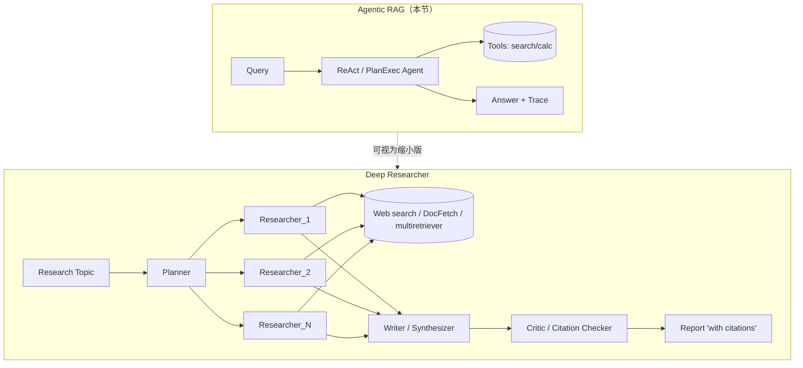

# C7.6 Agentic RAG 实施计划

> **For agentic workers:** REQUIRED SUB-SKILL: Use superpowers:subagent-driven-development (recommended) or superpowers:executing-plans to implement this plan task-by-task. Steps use checkbox (`- [ ]`) syntax for tracking.

**Goal:** 在 `notebook/C7 高级 RAG 技巧/6. 增强阶段/` 下新增 `4. Agentic RAG.ipynb`，实现 ReAct 与 Plan-then-Execute 两种 agent，并与 Multi-Doc Agent 三方对比。

**Architecture:** 复用 `_common.py` 公共底座；按南瓜书真实页码独立切 6 章 retriever 持久化到 `./chroma_db/agentic/`（与 6.3 隔离）；agent 实现全部手写在 notebook 内（不下沉），仅向 `_common.py` 增加 2 个纯函数工具（`safe_eval_arith` / `trace_tool_recall`）和 1 个共享判卷常量（`DIMENSIONAL_EVAL_PROMPT_2026`），并用 pytest 做 smoke test。

**Task 总数：12 个**（Task 1~10 + Task 3.5 + Task 3.6）。其中 Task 3.5 / 3.6 为 review 反馈追加（详见自检小节"Code review 反馈追踪"）。

**Tech Stack:** Jupyter Notebook · Python 3.10 · langchain-chroma · zhipuai (`glm-4-flash-250414`) · `BAAI/bge-small-zh-v1.5` · pytest

参考设计文档：`docs/plans/2026-04-22-c7-6-agentic-rag-design.md`

---

## 全局约定

**工作目录**：所有 `python -m pytest`、`jupyter nbconvert` 命令均在 `notebook/C7 高级 RAG 技巧/6. 增强阶段/` 下执行。

**Notebook 编辑**：使用 `EditNotebook` 工具，禁止用 `Write` 重写整个 notebook 文件（否则会破坏 cell metadata）。第一次创建空 notebook 时，使用 `EditNotebook` 的 `is_new_cell=true, cell_idx=0` 写入第一个 markdown cell。

**Cell 风格基线**：与 `3. 系统增强.ipynb` 完全一致——markdown 用 `## H2` 分节，代码 cell 顶部用注释说明用途，所有可调用函数有 docstring。

**LLM 调用频率**：本节默认 `llm_call(prompt, sleep_after=1.0)`，与 6.2/6.3 一致。

**提交节奏**：每完成一个 Task 提交一次，commit message 用 `feat(c7-6.4):` 前缀。

---

## Task 1: 题目集草案文件

**Files:**
- Create: `notebook/C7 高级 RAG 技巧/6. 增强阶段/data/agentic_eval.json`

- [ ] **Step 1: 写入 6 道多步题（来自设计文档第五节）**

```json
[
  {
    "id": "Q1",
    "question": "决策树和支持向量机在二分类时的决策边界形状有何区别？",
    "expected": "决策树边界是分段平行于坐标轴的轴对齐矩形（多个矩形拼接）；支持向量机用线性核时是超平面，用 RBF 核时是非线性平滑曲面。",
    "expected_tools": ["search_chapter:ch4_tree", "search_chapter:ch6_svm"]
  },
  {
    "id": "Q2",
    "question": "南瓜书式 6.11 是什么，几何意义是什么？",
    "expected": "式 6.11 是 SVM 对偶问题的拉格朗日函数；几何上对应在约束下最大化间隔。",
    "expected_tools": ["lookup_formula:6.11", "search_chapter:ch6_svm"]
  },
  {
    "id": "Q3",
    "question": "样本量 N=1000、特征数 d=20 时，KNN 预测一条样本和线性 SVM 预测一条样本的复杂度量级各是多少？",
    "expected": "KNN 预测一条 ≈ O(N·d) = 20000 次操作；线性 SVM 预测一条 ≈ O(d) = 20 次操作。",
    "expected_tools": ["search_chapter:ch10_knn", "search_chapter:ch6_svm", "calc"]
  },
  {
    "id": "Q4",
    "question": "南瓜书第 2 章和第 4 章都讨论了'剪枝'相关概念，两者的目的有何不同？",
    "expected": "第 2 章讨论的是模型选择中的过拟合控制（评估角度）；第 4 章讨论的是决策树预剪枝/后剪枝（结构角度），目的都是防止过拟合但操作对象不同。",
    "expected_tools": ["search_chapter:ch2_eval", "search_chapter:ch4_tree"]
  },
  {
    "id": "Q5",
    "question": "用基尼指数从样本数 100 的根节点分出 60/40 两子节点，根节点基尼值是多少？",
    "expected": "根节点 Gini = 1 - (0.6^2 + 0.4^2) = 0.48。",
    "expected_tools": ["search_chapter:ch4_tree", "calc"]
  },
  {
    "id": "Q6",
    "question": "ROC 曲线与 PR 曲线的核心区别是什么？哪种场景下 PR 更可靠？",
    "expected": "ROC 横轴 FPR、纵轴 TPR；PR 横轴 Recall、纵轴 Precision。类别极不平衡时 ROC 会高估性能，PR 更可靠。",
    "expected_tools": ["search_chapter:ch2_eval"]
  }
]
```

> 注 1：Q5 已从原"基尼增益"简化为"根节点基尼值"，让 calc 工具有明确的算式（`1 - (0.6**2 + 0.4**2)`），避免子节点分布不明导致评估扯皮。
>
> 注 2：Q1/Q2/Q3 的 `expected_tools` 已修正为引用 `ch6_svm` / `ch10_knn`（南瓜书 SVM 在第 6 章、KNN 在第 10 章）。配套章节切分见 Task 4 Step 3。

- [ ] **Step 1.5: lint expected_tools value（防伪命中）**

`trace_tool_recall` 把 `tool:value` 拼成命中集，若某道 query 文本恰好等于 `ch6_svm` 这种 chapter_id，会出现 ghost hit。这一步保证所有 `expected_tools` value 都落在合法实体集合里。

```bash
cd "notebook/C7 高级 RAG 技巧/6. 增强阶段"
python3 -c "
import json, re
data = json.load(open('data/agentic_eval.json'))
allowed_chapters = {'ch1_intro','ch2_eval','ch3_linear','ch4_tree','ch6_svm','ch10_knn'}
allowed_tool_only = {'calc'}                       # 不带 :value
allowed_tools = {'search_chapter','lookup_formula','search_full_corpus','calc'}
formula_re = re.compile(r'^\d+\.\d+$')             # 如 6.11
errors = []
for q in data:
    for spec in q['expected_tools']:
        if ':' in spec:
            tool, val = spec.split(':', 1)
            if tool not in allowed_tools:
                errors.append(f'{q[\"id\"]}: 未知工具 {tool!r}')
            elif tool == 'search_chapter' and val not in allowed_chapters:
                errors.append(f'{q[\"id\"]}: search_chapter 章节 {val!r} 不合法')
            elif tool == 'lookup_formula' and not formula_re.match(val):
                errors.append(f'{q[\"id\"]}: lookup_formula 编号 {val!r} 格式不合法')
        else:
            if spec not in allowed_tool_only:
                errors.append(f'{q[\"id\"]}: 仅工具名 {spec!r} 不在白名单（只允许 calc 这种无实体参数的工具）')
if errors:
    raise SystemExit('\\n'.join(errors))
print(f'✅ {len(data)} 道题的 expected_tools 全部合法')
"
```

Expected: `✅ 6 道题的 expected_tools 全部合法`。失败时按提示回到 Step 1 修题集。

- [ ] **Step 2: 提交**

```bash
git add "notebook/C7 高级 RAG 技巧/6. 增强阶段/data/agentic_eval.json"
git commit -m "feat(c7-6.4): add agentic_eval.json with 6 multi-step questions"
```

---

## Task 2: 在 `_common.py` 增加 `safe_eval_arith`（TDD）

**Files:**
- Modify: `notebook/C7 高级 RAG 技巧/6. 增强阶段/_common.py`（在文件末尾追加）
- Test: `notebook/C7 高级 RAG 技巧/6. 增强阶段/tests/test_common_basic.py`

- [ ] **Step 1: 写失败的测试**

在 `tests/test_common_basic.py` 末尾追加：

```python
# ---- safe_eval_arith ----

def test_safe_eval_arith_basic_ops():
    from _common import safe_eval_arith
    assert safe_eval_arith("1 + 2") == "3"
    assert safe_eval_arith("(1 + 2) * 3") == "9"
    assert safe_eval_arith("2 ** 10") == "1024"


def test_safe_eval_arith_float_ops():
    from _common import safe_eval_arith
    assert abs(float(safe_eval_arith("1 - (0.6**2 + 0.4**2)")) - 0.48) < 1e-9


def test_safe_eval_arith_supports_log_sqrt():
    from _common import safe_eval_arith
    assert abs(float(safe_eval_arith("sqrt(16)")) - 4.0) < 1e-9
    assert abs(float(safe_eval_arith("log(2.718281828, 2.718281828)")) - 1.0) < 1e-6


def test_safe_eval_arith_rejects_unsafe():
    from _common import safe_eval_arith
    import pytest as _pt
    with _pt.raises(ValueError):
        safe_eval_arith("__import__('os').system('ls')")
    with _pt.raises(ValueError):
        safe_eval_arith("open('a')")
```

- [ ] **Step 2: 跑测试，确认失败**

```bash
cd "notebook/C7 高级 RAG 技巧/6. 增强阶段"
python -m pytest tests/test_common_basic.py::test_safe_eval_arith_basic_ops -v
```

Expected: `ImportError: cannot import name 'safe_eval_arith'`

- [ ] **Step 3: 实现 `safe_eval_arith`**

在 `_common.py` 末尾追加：

```python
# ---------- 6.4 节 Agentic RAG 工具 ----------

import ast as _ast
import math as _math


_SAFE_EVAL_ALLOWED_NAMES = {
    "log": _math.log, "sqrt": _math.sqrt, "exp": _math.exp,
    "sin": _math.sin, "cos": _math.cos, "tan": _math.tan,
    "pi": _math.pi, "e": _math.e,
}

_SAFE_EVAL_ALLOWED_NODES = (
    _ast.Expression, _ast.BinOp, _ast.UnaryOp, _ast.Constant,
    _ast.Num, _ast.Add, _ast.Sub, _ast.Mult, _ast.Div, _ast.Mod,
    _ast.Pow, _ast.USub, _ast.UAdd, _ast.FloorDiv,
    _ast.Call, _ast.Name, _ast.Load,
)


def safe_eval_arith(expr: str) -> str:
    """白名单算术求值。支持 + - * / ** % // 与 log/sqrt/exp/sin/cos/tan/pi/e。
    任何非白名单节点或名称都会抛 ValueError。返回字符串形式结果。"""
    try:
        tree = _ast.parse(expr, mode="eval")
    except SyntaxError as e:
        raise ValueError(f"非法表达式（语法）：{e}") from e

    for node in _ast.walk(tree):
        if not isinstance(node, _SAFE_EVAL_ALLOWED_NODES):
            raise ValueError(f"非法表达式（含禁止的节点 {type(node).__name__}）")
        if isinstance(node, _ast.Name) and node.id not in _SAFE_EVAL_ALLOWED_NAMES:
            raise ValueError(f"非法表达式（含未知名称 {node.id}）")
        if isinstance(node, _ast.Call):
            if not isinstance(node.func, _ast.Name) or node.func.id not in _SAFE_EVAL_ALLOWED_NAMES:
                raise ValueError("非法表达式（不允许的函数调用）")

    val = eval(  # noqa: S307 — 受白名单严格保护
        compile(tree, "<safe_eval>", "eval"),
        {"__builtins__": {}},
        dict(_SAFE_EVAL_ALLOWED_NAMES),
    )
    if isinstance(val, float) and val.is_integer():
        return str(int(val))
    return str(val)
```

- [ ] **Step 4: 跑测试，确认全部通过**

```bash
python -m pytest tests/test_common_basic.py -v -k safe_eval_arith
```

Expected: `4 passed`

- [ ] **Step 5: 提交**

```bash
git add "notebook/C7 高级 RAG 技巧/6. 增强阶段/_common.py" \
       "notebook/C7 高级 RAG 技巧/6. 增强阶段/tests/test_common_basic.py"
git commit -m "feat(c7-6.4): add safe_eval_arith helper with whitelist AST walker"
```

---

## Task 3: 在 `_common.py` 增加 `trace_tool_recall`（TDD）

**Files:**
- Modify: `notebook/C7 高级 RAG 技巧/6. 增强阶段/_common.py`
- Test: `notebook/C7 高级 RAG 技巧/6. 增强阶段/tests/test_common_basic.py`

- [ ] **Step 1: 写失败的测试**

```python
# ---- trace_tool_recall ----

def test_trace_tool_recall_full_match():
    from _common import trace_tool_recall
    trace = [
        {"kind": "tool_call", "tool": "search_chapter", "args": {"chapter_id": "ch3_linear", "query": "x"}},
        {"kind": "tool_call", "tool": "search_chapter", "args": {"chapter_id": "ch4_tree", "query": "y"}},
    ]
    expected = ["search_chapter:ch3_linear", "search_chapter:ch4_tree"]
    assert trace_tool_recall(trace, expected) == 1.0


def test_trace_tool_recall_partial():
    from _common import trace_tool_recall
    trace = [
        {"kind": "tool_call", "tool": "search_chapter", "args": {"chapter_id": "ch4_tree", "query": "y"}},
    ]
    expected = ["search_chapter:ch3_linear", "search_chapter:ch4_tree"]
    assert trace_tool_recall(trace, expected) == 0.5


def test_trace_tool_recall_no_args_tool():
    from _common import trace_tool_recall
    trace = [{"kind": "tool_call", "tool": "calc", "args": {"expr": "1+1"}}]
    expected = ["calc"]
    assert trace_tool_recall(trace, expected) == 1.0


def test_trace_tool_recall_empty_expected_returns_one():
    from _common import trace_tool_recall
    assert trace_tool_recall([], []) == 1.0
    assert trace_tool_recall([{"kind": "tool_call", "tool": "calc", "args": {}}], []) == 1.0


def test_trace_tool_recall_ignores_non_tool_steps():
    from _common import trace_tool_recall
    trace = [
        {"kind": "thought", "text": "..."},
        {"kind": "tool_call", "tool": "calc", "args": {"expr": "1+1"}},
        {"kind": "final", "answer": "2"},
    ]
    assert trace_tool_recall(trace, ["calc"]) == 1.0
```

- [ ] **Step 2: 跑测试，确认失败**

```bash
python -m pytest tests/test_common_basic.py -v -k trace_tool_recall
```

Expected: `ImportError: cannot import name 'trace_tool_recall'`

- [ ] **Step 3: 实现 `trace_tool_recall`**

在 `_common.py`（紧接 `safe_eval_arith` 之后）追加：

```python
def trace_tool_recall(trace: list[dict], expected_tools: list[str]) -> float:
    """trace 命中 expected_tools 的覆盖率。

    expected_tools 元素格式：
      - "tool_name"            仅匹配工具名（如 "calc"）
      - "tool_name:value"      匹配工具名 AND value 出现在 args.values() 中
                               （如 "search_chapter:ch6_svm" 命中
                                args={"chapter_id": "ch6_svm", "query": ...}）

    约束：expected_tools 中的 value 应只填实体类参数（chapter_id、formula_id 等）；
    不要填 query/expr 等自由文本，否则可能与其他工具的同名参数发生伪命中。

    expected_tools 为空时返回 1.0。
    """
    if not expected_tools:
        return 1.0

    actual: set[str] = set()
    for step in trace:
        if step.get("kind") != "tool_call":
            continue
        tool = step.get("tool", "")
        args = step.get("args", {}) or {}
        actual.add(tool)
        for v in args.values():
            actual.add(f"{tool}:{v}")

    hit = sum(1 for e in expected_tools if e in actual)
    return hit / len(expected_tools)
```

- [ ] **Step 4: 跑测试，确认全部通过**

```bash
python -m pytest tests/test_common_basic.py -v -k trace_tool_recall
```

Expected: `5 passed`

- [ ] **Step 5: 跑全量 smoke test，确认未破坏既有用例**

```bash
python -m pytest tests/ -v
```

Expected: 全部 PASS（既有用例数 + 9 个新用例）

- [ ] **Step 6: 提交**

```bash
git add "notebook/C7 高级 RAG 技巧/6. 增强阶段/_common.py" \
       "notebook/C7 高级 RAG 技巧/6. 增强阶段/tests/test_common_basic.py"
git commit -m "feat(c7-6.4): add trace_tool_recall metric helper"
```

---

## Task 3.5: 把 `DIMENSIONAL_EVAL_PROMPT` 抬到 `_common.py`（DRY）

**背景**：6.2 节 notebook 内已经定义了 `DIMENSIONAL_EVAL_PROMPT`（见 `2. 流程增强.ipynb` 第 208~219 行）。本节 4.6 评估也需要它。为避免两节字符串副本漂移、并方便未来章节复用，抬到 `_common.py` 作为常量。

**Files:**
- Modify: `notebook/C7 高级 RAG 技巧/6. 增强阶段/_common.py`
- Test: `notebook/C7 高级 RAG 技巧/6. 增强阶段/tests/test_common_basic.py`

> 注：本 Task **不**改 `2. 流程增强.ipynb`——避免改动范围扩散；6.2 那段本地副本与新常量等价，待后续清理 PR 单独处理。

- [ ] **Step 1: 写测试**

在 `tests/test_common_basic.py` 末尾追加：

```python
# ---- DIMENSIONAL_EVAL_PROMPT_2026 ----

def test_dimensional_eval_prompt_constant_present():
    from _common import DIMENSIONAL_EVAL_PROMPT_2026
    assert "判卷人" in DIMENSIONAL_EVAL_PROMPT_2026
    assert "{question}" in DIMENSIONAL_EVAL_PROMPT_2026
    assert "{expected_answer}" in DIMENSIONAL_EVAL_PROMPT_2026
    assert "{llm_answer}" in DIMENSIONAL_EVAL_PROMPT_2026


def test_dimensional_eval_prompt_can_format():
    from _common import DIMENSIONAL_EVAL_PROMPT_2026
    out = DIMENSIONAL_EVAL_PROMPT_2026.format(
        question="Q?", expected_answer="A.", llm_answer="A!",
    )
    assert "Q?" in out and "A." in out and "A!" in out


def test_dimensional_eval_prompt_matches_6_2_inline_copy():
    """防漂移：6.2 节 notebook 内仍保留的 DIMENSIONAL_EVAL_PROMPT 字符串
    必须与 _common.DIMENSIONAL_EVAL_PROMPT_2026 完全一致；任一处改动须同步。
    待 6.2 副本被清理为 import 之后，本测试可以安全删除。"""
    import json
    from pathlib import Path
    from _common import DIMENSIONAL_EVAL_PROMPT_2026

    nb_path = Path(__file__).resolve().parent.parent / "2. 流程增强.ipynb"
    nb = json.loads(nb_path.read_text(encoding="utf-8"))
    inline_src = None
    for cell in nb["cells"]:
        if cell.get("cell_type") != "code":
            continue
        src = "".join(cell.get("source", []))
        if "DIMENSIONAL_EVAL_PROMPT = (" in src:
            inline_src = src
            break
    assert inline_src is not None, "6.2 notebook 中未找到 DIMENSIONAL_EVAL_PROMPT 定义"

    # 解析 6.2 中的字面量定义并与常量对比
    ns: dict = {}
    exec(inline_src, ns)
    assert ns["DIMENSIONAL_EVAL_PROMPT"] == DIMENSIONAL_EVAL_PROMPT_2026, (
        "6.2 notebook 内 DIMENSIONAL_EVAL_PROMPT 与 _common 常量已漂移；"
        "请同步更新两边或清理 6.2 副本。"
    )
```

- [ ] **Step 2: 跑测试，确认失败**

```bash
cd "notebook/C7 高级 RAG 技巧/6. 增强阶段"
python -m pytest tests/test_common_basic.py -v -k dimensional_eval_prompt
```

Expected: `ImportError: cannot import name 'DIMENSIONAL_EVAL_PROMPT_2026'`

- [ ] **Step 3: 在 `_common.py` 末尾追加常量**

```python
# 6.2 / 6.4 节共用的"按要点覆盖打 0~2 分"判卷 prompt。
# 与 2. 流程增强.ipynb 内当前定义的 DIMENSIONAL_EVAL_PROMPT 字符串相同；
# 抬到 _common.py 作为单一来源，避免跨节漂移。
DIMENSIONAL_EVAL_PROMPT_2026 = (
    "你是判卷人。先在心里把「参考答案」拆成 2~4 个【必答要点】"
    "（如：方法1、方法2、关键条件、关键定义等），不要输出这些要点。\n"
    "然后比对「模型答案」覆盖了几个要点：\n"
    "- 全部覆盖且无关键事实错误：2\n"
    "- 覆盖一半左右、或部分要点表述含糊但方向正确：1\n"
    "- 大部分要点缺失、或关键事实错误：0\n\n"
    "用户问题：{question}\n参考答案：{expected_answer}\n模型答案：{llm_answer}\n\n"
    "仅输出一行，只包含字符 0、1 或 2，不要任何其它文字。"
)
```

- [ ] **Step 4: 跑测试确认通过**

```bash
python -m pytest tests/test_common_basic.py -v -k dimensional_eval_prompt
```

Expected: `3 passed`（含 `test_dimensional_eval_prompt_matches_6_2_inline_copy` 的副本等价校验）

- [ ] **Step 5: 跑全量 smoke**

```bash
python -m pytest tests/ -v
```

Expected: 全部 PASS。

- [ ] **Step 6: 提交**

```bash
git add "notebook/C7 高级 RAG 技巧/6. 增强阶段/_common.py" \
       "notebook/C7 高级 RAG 技巧/6. 增强阶段/tests/test_common_basic.py"
git commit -m "refactor(c7-6): lift DIMENSIONAL_EVAL_PROMPT_2026 to _common.py"
```

---

## Task 3.6: 在 `_common.py` 增加 ReAct / Plan parser（TDD）

**背景**：parser 是 agent 框架里**最容易翻车**的环节（fence、中文标点、JSON 内嵌引号等）。把 `parse_react_response` / `parse_plan_json` 抬到 `_common.py` 集中测试，比裸放在 notebook 里只靠 nbconvert smoke 抗扰动得多。Task 5 / 6 改成直接 import 复用。

**Files:**
- Modify: `notebook/C7 高级 RAG 技巧/6. 增强阶段/_common.py`
- Test: `notebook/C7 高级 RAG 技巧/6. 增强阶段/tests/test_common_basic.py`

- [ ] **Step 1: 写失败的测试**

在 `tests/test_common_basic.py` 末尾追加：

```python
# ---- parse_react_response / parse_plan_json ----

def test_parse_react_response_standard():
    from _common import parse_react_response
    raw = (
        "Thought: 先查 SVM 边界\n"
        'Action: {"tool": "search_chapter", "args": {"chapter_id": "ch6_svm", "query": "决策边界"}}'
    )
    th, ac = parse_react_response(raw)
    assert "SVM" in th
    assert ac == {"tool": "search_chapter", "args": {"chapter_id": "ch6_svm", "query": "决策边界"}}


def test_parse_react_response_with_json_fence():
    from _common import parse_react_response
    raw = (
        "Thought: 计算\n"
        "Action: ```json\n"
        '{"tool": "calc", "args": {"expr": "1+2"}}\n'
        "```"
    )
    _, ac = parse_react_response(raw)
    assert ac == {"tool": "calc", "args": {"expr": "1+2"}}


def test_parse_react_response_chinese_colon():
    from _common import parse_react_response
    raw = "Thought：分析问题\nAction：{\"tool\": \"calc\", \"args\": {\"expr\": \"2*3\"}}"
    th, ac = parse_react_response(raw)
    assert "分析" in th
    assert ac is not None and ac["tool"] == "calc"


def test_parse_react_response_missing_thought_returns_action():
    from _common import parse_react_response
    raw = 'Action: {"tool": "calc", "args": {"expr": "1+1"}}'
    th, ac = parse_react_response(raw)
    assert th == ""
    assert ac == {"tool": "calc", "args": {"expr": "1+1"}}


def test_parse_react_response_no_action_returns_none():
    from _common import parse_react_response
    raw = "Thought: 我不知道怎么办\n（没有 Action 行）"
    th, ac = parse_react_response(raw)
    assert ac is None


def test_parse_react_response_nested_braces():
    """JSON 内嵌的 {} 不能被 r'\\{.*\\}' 的最短匹配截断。"""
    from _common import parse_react_response
    raw = (
        "Thought: x\n"
        'Action: {"tool": "search_chapter", "args": {"chapter_id": "ch6_svm", "query": "决策边界"}}'
    )
    _, ac = parse_react_response(raw)
    assert ac["args"]["chapter_id"] == "ch6_svm"


def test_parse_plan_json_standard():
    from _common import parse_plan_json
    raw = '[{"tool": "search_chapter", "args": {"chapter_id": "ch6_svm", "query": "x"}}]'
    plan = parse_plan_json(raw)
    assert isinstance(plan, list) and len(plan) == 1
    assert plan[0]["tool"] == "search_chapter"


def test_parse_plan_json_with_fence_and_prose():
    from _common import parse_plan_json
    raw = (
        "好，这是计划：\n"
        "```json\n"
        '[\n  {"tool": "calc", "args": {"expr": "1+1"}}\n]\n'
        "```\n"
        "希望有用。"
    )
    plan = parse_plan_json(raw)
    assert plan == [{"tool": "calc", "args": {"expr": "1+1"}}]


def test_parse_plan_json_invalid_returns_none():
    from _common import parse_plan_json
    assert parse_plan_json("我没法规划") is None
    assert parse_plan_json("[invalid json,]") is None
```

- [ ] **Step 2: 跑测试，确认失败**

```bash
cd "notebook/C7 高级 RAG 技巧/6. 增强阶段"
python -m pytest tests/test_common_basic.py -v -k "parse_react or parse_plan"
```

Expected: `ImportError: cannot import name 'parse_react_response'`

- [ ] **Step 3: 在 `_common.py` 末尾追加实现**

```python
# ---------- 6.4 节 Agentic RAG parser ----------

# 中英文冒号都允许；Action JSON 用括号配对扫描，避免 r"\{.*\}" 把内嵌 {} 截断。
_THOUGHT_RE_C7_6 = re.compile(r"Thought\s*[：:]\s*(.+?)(?:\n|$)")
_ACTION_HEAD_RE_C7_6 = re.compile(r"Action\s*[：:]\s*")


def _extract_balanced_json_object(s: str) -> str | None:
    """从字符串首个 '{' 起按括号配对截出第一个完整 JSON 对象。"""
    start = s.find("{")
    if start == -1:
        return None
    depth = 0
    in_str = False
    esc = False
    for i in range(start, len(s)):
        ch = s[i]
        if in_str:
            if esc:
                esc = False
            elif ch == "\\":
                esc = True
            elif ch == '"':
                in_str = False
            continue
        if ch == '"':
            in_str = True
        elif ch == "{":
            depth += 1
        elif ch == "}":
            depth -= 1
            if depth == 0:
                return s[start : i + 1]
    return None


def parse_react_response(raw: str) -> tuple[str, dict | None]:
    """解析单轮 ReAct 输出，返回 (thought, action_dict_or_None)。
    容忍：中英冒号、```json fence、Thought 缺失、Action 内嵌 {}。
    """
    if not raw:
        return "", None
    th_m = _THOUGHT_RE_C7_6.search(raw)
    thought = th_m.group(1).strip() if th_m else ""
    head_m = _ACTION_HEAD_RE_C7_6.search(raw)
    if not head_m:
        return thought, None
    tail = raw[head_m.end():]
    js = _extract_balanced_json_object(tail)
    if js is None:
        return thought, None
    try:
        obj = json.loads(js)
        return thought, obj if isinstance(obj, dict) else None
    except json.JSONDecodeError:
        return thought, None


def parse_plan_json(raw: str) -> list[dict] | None:
    """解析 PlanThenExecute 的 plan 输出，返回 list[dict] 或 None。
    容忍：```json fence、首尾散文、空白。
    """
    if not raw:
        return None
    s = raw.strip()
    lo = s.find("[")
    hi = s.rfind("]")
    if lo == -1 or hi == -1 or hi < lo:
        return None
    try:
        obj = json.loads(s[lo : hi + 1])
        if not isinstance(obj, list):
            return None
        return [item for item in obj if isinstance(item, dict)] or None
    except json.JSONDecodeError:
        return None
```

> 说明：`json` 已在 `_common.py` 顶部 import；`re` 同。无新增依赖。

- [ ] **Step 4: 跑测试，确认全部通过**

```bash
python -m pytest tests/test_common_basic.py -v -k "parse_react or parse_plan"
```

Expected: `9 passed`

- [ ] **Step 5: 跑全量 smoke**

```bash
python -m pytest tests/ -v
```

Expected: 全部 PASS。

- [ ] **Step 6: 提交**

```bash
git add "notebook/C7 高级 RAG 技巧/6. 增强阶段/_common.py" \
       "notebook/C7 高级 RAG 技巧/6. 增强阶段/tests/test_common_basic.py"
git commit -m "feat(c7-6.4): add parse_react_response/parse_plan_json with TDD"
```

---

## Task 4: 创建 notebook 骨架（4.0 / 4.1 / 4.2 节）

**Files:**
- Create: `notebook/C7 高级 RAG 技巧/6. 增强阶段/4. Agentic RAG.ipynb`

- [ ] **Step 1: 创建 notebook 第 0 个 markdown cell（标题与定位）**

使用 `EditNotebook`，`cell_idx=0, is_new_cell=true, cell_language=markdown`，`new_string`：

```markdown
# 4. Agentic RAG

这一节解决的问题是：**当系统需要"自主决定何时检索、检索什么、用哪个工具、是否再走一步"，单步路由或固定模板都不够时，如何用 agent 框架把检索作为一种工具调度起来。**

## 与已有方法的边界

| 已有方法 | 局限 |
|---|---|
| 2.5 Self-RAG / CRAG | 单 query 内的固定反思模板，无工具选择，无任务规划 |
| 3.2 Memory | 跨轮指代消解，不解决"该走几步、走哪条" |
| 3.3 Multi-Document Agent | 单步 LLM 路由 + 单次检索，没有"看一眼结果再决定下一步" |

Agentic RAG 的独有点是 **Plan-Act-Observe-Reflect 闭环 + 工具集 + 可观测 trace**，把前面所有方法都视作可调用的子能力。

## 本节钩子升级：`class XxxAgent: ask(q) -> (answer, trace)`

6.3 的 `ask(q) -> str` 在这里不够用——评估"用对工具没""走了几步"必须能看到过程。所以本节钩子升一层：

```
class XxxAgent:
    def ask(q) -> (answer: str, trace: list[dict])
```

`trace` 元素是结构化字典，至少有 `{"kind": "thought"|"tool_call"|"observation"|"final", ...}`。
```

- [ ] **Step 2: 增加 4.1 环境准备 markdown cell（cell_idx=1, is_new_cell=true）**

```markdown
## 4.1 统一实验设置

与 6.1 / 6.2 / 6.3 保持一致：

- **数据**：南瓜书 PDF，复用 `_common.py` 公共底座；本节按真实页码切 6 章（ch1_intro / ch2_eval / ch3_linear / ch4_tree / ch6_svm / ch10_knn），独立持久化到 `./chroma_db/agentic/`
- **多步评估题**：`data/agentic_eval.json`（6 道题，含 `expected_tools` 字段）
- **生成模型**：`glm-4-flash-250414`
- **向量模型**：本地 `BAAI/bge-small-zh-v1.5`
- **评估**：复用 6.2 的 `DIMENSIONAL_EVAL_PROMPT`（按要点覆盖打 0~2 分）+ 新增 `trace_tool_recall`
```

- [ ] **Step 2.5: 页码对账（必须在 Step 3 写死 `SOURCE_PAGE_RANGES` 之前跑）**

> **背景**：6.3 的 `SOURCE_PAGE_RANGES` 错位 bug 之所以一直没被发现，正是因为只跑 nbconvert smoke、从未对内容做过断言。本节 6 章页码是基于已知 PDF 实测的，但**任何"经实测"的页码都必须有可重跑的断言**，否则等同于空中楼阁。

```bash
cd "notebook/C7 高级 RAG 技巧/6. 增强阶段"
python3 -c "
import sys; sys.path.insert(0, '.')
from _common import get_cleaned_pdf_documents

ranges = {
    'ch1_intro':  (13, 16),
    'ch2_eval':   (17, 25),
    'ch3_linear': (30, 43),
    'ch4_tree':   (44, 52),
    'ch6_svm':    (59, 73),
    'ch10_knn':   (119, 137),
}
keywords = {
    'ch1_intro':  ['绪论', '机器学习'],
    'ch2_eval':   ['模型评估', '评估方法', '性能度量'],
    'ch3_linear': ['线性模型', '线性回归', '对数几率'],
    'ch4_tree':   ['决策树', '信息增益', '基尼'],
    'ch6_svm':    ['支持向量', '间隔', '核函数'],
    'ch10_knn':   ['近邻', 'kNN', '降维', '度量学习'],
}
pages = list(get_cleaned_pdf_documents())
errors = []
for ch, (lo, hi) in ranges.items():
    span = '\\n'.join(p.page_content for p in pages if lo <= p.metadata.get('page', -1) <= hi)
    head = pages[lo].page_content[:80] if lo < len(pages) else ''
    hits = [k for k in keywords[ch] if k in span]
    print(f'{ch} (p{lo}~{hi}) 命中关键词={hits} 首页头={head!r}')
    if not hits:
        errors.append(f'{ch}: 区间 ({lo},{hi}) 内未命中任何关键词 {keywords[ch]}')
if errors:
    raise SystemExit('\\n'.join(['❌ 页码对账失败：'] + errors))
print('\\n✅ 6 章页码对账通过')
"
```

Expected: 每章至少命中 1 个关键词，最后输出 `✅ 6 章页码对账通过`。

如果某章命中 0 个关键词，**不要往下走**——回头用下面这条诊断脚本找正确页码：

```bash
python3 -c "
import sys, re; sys.path.insert(0, '.')
from _common import get_cleaned_pdf_documents
for p in get_cleaned_pdf_documents():
    m = re.search(r'第\s*([一二三四五六七八九十0-9]+)\s*章', p.page_content)
    if m: print(f'page {p.metadata[\"page\"]:3d}: {p.page_content[m.start():m.start()+40]}')
"
```

修正 Step 3 的 `SOURCE_PAGE_RANGES` 后**重跑 Step 2.5** 直到通过。

- [ ] **Step 3: 增加 4.1 环境准备 code cell（cell_idx=2, is_new_cell=true, cell_language=python）**

```python
import os, re, json, warnings
from dataclasses import dataclass, field
from typing import Any, Callable
import pandas as pd
from langchain_core.documents import Document
from langchain_text_splitters import RecursiveCharacterTextSplitter

import sys
sys.path.insert(0, ".")
from _common import (
    get_embeddings, get_cleaned_pdf_documents, open_or_build_chroma,
    llm_call as _raw_llm_call, build_rag_generation_prompt,
    trim_context_to_budget, simple_eval_2pt, build_compare_table,
    compare_method_with_baseline,
    safe_eval_arith, trace_tool_recall, DIMENSIONAL_EVAL_PROMPT_2026,
    PDF_PATH, CONTEXT_CHAR_BUDGET,
)

warnings.filterwarnings("ignore")


def llm_call(prompt: str) -> str:
    return _raw_llm_call(prompt, sleep_after=1.0)


def load_chunks(chunk_size=256, chunk_overlap=20):
    docs = list(get_cleaned_pdf_documents())
    splitter = RecursiveCharacterTextSplitter(
        chunk_size=chunk_size, chunk_overlap=chunk_overlap,
        separators=["\n\n", "\n", " ", ""], keep_separator=True,
    )
    return splitter.split_documents(docs)


def build_full_retriever(k=4):
    chunks = load_chunks()
    ids = [f"b{i}" for i in range(len(chunks))]
    vs = open_or_build_chroma("./chroma_db/baseline_256_20", chunks, ids)
    return vs.as_retriever(search_kwargs={"k": k})


# 注：6.3 的 SOURCE_PAGE_RANGES 与南瓜书真实页码错位（详见 docs/plans 末尾 "已知 issue"）。
# 本节用全新、经实测的真实页码 + 独立 chroma 持久化目录 ./chroma_db/agentic/，与 6.3 互不影响。

SOURCE_PAGE_RANGES = {
    "ch1_intro":  (13, 16),
    "ch2_eval":   (17, 25),
    "ch3_linear": (30, 43),
    "ch4_tree":   (44, 52),
    "ch6_svm":    (59, 73),
    "ch10_knn":   (119, 137),
}

SOURCE_DESCRIPTIONS = {
    "ch1_intro":  "第1章 绪论：机器学习基本术语、假设空间、归纳偏好。",
    "ch2_eval":   "第2章 模型评估与选择：留出法、交叉验证、自助法、查准查全率、ROC、偏差方差。",
    "ch3_linear": "第3章 线性模型：线性回归、对数几率回归、LDA、多分类、类别不平衡。",
    "ch4_tree":   "第4章 决策树：信息增益、增益率、基尼指数、剪枝、连续与缺失值。",
    "ch6_svm":    "第6章 支持向量机：间隔与支持向量、对偶问题、核函数、软间隔、SVM 复杂度。",
    "ch10_knn":   "第10章 降维与度量学习：KNN（k 近邻）、距离度量、PCA、流形学习。",
}


def build_chapter_sources(k=4):
    splitter = RecursiveCharacterTextSplitter(
        chunk_size=256, chunk_overlap=20,
        separators=["\n\n", "\n", " ", ""], keep_separator=True,
    )
    pages = list(get_cleaned_pdf_documents())
    retrievers = {}
    for name, (lo, hi) in SOURCE_PAGE_RANGES.items():
        page_docs = [p for p in pages if lo <= p.metadata.get("page", -1) <= hi and p.page_content.strip()]
        chunks = splitter.split_documents(page_docs)
        if not chunks:
            continue
        ids = [f"{name}-{i}" for i in range(len(chunks))]
        vs = open_or_build_chroma(f"./chroma_db/agentic/{name}", chunks, ids)
        retrievers[name] = vs.as_retriever(search_kwargs={"k": k})
    return retrievers


FULL_RETRIEVER = build_full_retriever()
CHAPTER_RETRIEVERS = build_chapter_sources()
PDF_FULL_TEXT = "\n".join(p.page_content for p in get_cleaned_pdf_documents())

with open("data/agentic_eval.json", "r", encoding="utf-8") as f:
    AGENTIC_EVAL = json.load(f)
AGENTIC_QNA = {item["question"]: item["expected"] for item in AGENTIC_EVAL}
EXPECTED_TOOLS_BY_Q = {item["question"]: item["expected_tools"] for item in AGENTIC_EVAL}

print(f"✅ 6.4 环境准备完成：sources={list(CHAPTER_RETRIEVERS.keys())}，eval_q={len(AGENTIC_EVAL)}")
```

> 说明：本 cell 用独立的 `chroma_db/agentic/` 持久化目录，与 6.3 的 `chroma_db/multi_doc/` 互不影响。首次运行需要构建 6 个小索引（每个几 MB，1~2 分钟），二次运行从缓存秒开。

- [ ] **Step 4: 增加 4.2 工具集设计 markdown cell（cell_idx=3, is_new_cell=true）**

```markdown
## 4.2 工具集设计

差异化工具是 Agentic RAG 教学的核心——只挂一个 retriever，agent 没什么决策可做。本节准备 4 个工具：

| 工具名 | 参数 | 用途 |
|---|---|---|
| `search_full_corpus` | `query` | 全库兜底检索 |
| `search_chapter` | `chapter_id, query` | 章节定向检索（chapter_id ∈ ch1_intro/ch2_eval/ch3_linear/ch4_tree/ch6_svm/ch10_knn） |
| `lookup_formula` | `formula_id` | 按 "6.11" 这样的编号在 PDF 中查公式上下文 |
| `calc` | `expr` | 安全白名单算术 |

`ToolRegistry` 提供：① 注册工具；② 统一调用（带异常兜底）；③ 把工具签名拼成 prompt schema 喂给 LLM。
```

- [ ] **Step 5: 增加 4.2 工具集 code cell（cell_idx=4, is_new_cell=true, cell_language=python）**

```python
@dataclass
class ToolSpec:
    name: str
    fn: Callable[[dict], str]
    desc: str
    args_schema: dict[str, str]


class ToolRegistry:
    """登记 + 调用 + 出 prompt schema。"""

    def __init__(self) -> None:
        self._tools: dict[str, ToolSpec] = {}

    def register(self, name: str, fn: Callable, desc: str, args_schema: dict) -> None:
        self._tools[name] = ToolSpec(name, fn, desc, args_schema)

    def call(self, name: str, args: dict) -> str:
        if name not in self._tools:
            return f"[tool_error] 未知工具：{name}；可用工具：{list(self._tools)}"
        try:
            return self._tools[name].fn(args)
        except Exception as e:
            return f"[tool_error] {name} 执行失败：{type(e).__name__}: {e}"

    def to_prompt_schema(self) -> str:
        lines = ["你可以调用的工具："]
        for t in self._tools.values():
            args_str = ", ".join(f"{k}: {v}" for k, v in t.args_schema.items())
            lines.append(f"- {t.name}({args_str}) — {t.desc}")
        return "\n".join(lines)

    @property
    def names(self) -> list[str]:
        return list(self._tools)


def _tool_search_full_corpus(args: dict) -> str:
    q = args["query"]
    docs = FULL_RETRIEVER.invoke(q)
    if not docs:
        return "（未检索到相关内容）"
    return trim_context_to_budget("\n\n".join(d.page_content for d in docs), CONTEXT_CHAR_BUDGET)


def _tool_search_chapter(args: dict) -> str:
    cid = args["chapter_id"]
    q = args["query"]
    if cid not in CHAPTER_RETRIEVERS:
        return f"[tool_error] 未知章节 {cid}；可选：{list(CHAPTER_RETRIEVERS)}"
    docs = CHAPTER_RETRIEVERS[cid].invoke(q)
    if not docs:
        return f"（章节 {cid} 中未检索到相关内容）"
    return trim_context_to_budget("\n\n".join(d.page_content for d in docs), CONTEXT_CHAR_BUDGET)


_FORMULA_PATTERN_CACHE: dict[str, str] = {}

def _tool_lookup_formula(args: dict) -> str:
    fid = str(args["formula_id"]).strip()
    if fid in _FORMULA_PATTERN_CACHE:
        return _FORMULA_PATTERN_CACHE[fid]
    pat = re.compile(rf"[（(]\s*式?\s*{re.escape(fid)}\s*[)）]")
    m = pat.search(PDF_FULL_TEXT)
    if not m:
        out = f"（未在原文中找到式 {fid}）"
    else:
        lo = max(0, m.start() - 200)
        hi = min(len(PDF_FULL_TEXT), m.end() + 200)
        out = PDF_FULL_TEXT[lo:hi]
    _FORMULA_PATTERN_CACHE[fid] = out
    return out


def _tool_calc(args: dict) -> str:
    return safe_eval_arith(str(args["expr"]))


def build_default_registry() -> ToolRegistry:
    reg = ToolRegistry()
    reg.register(
        "search_full_corpus", _tool_search_full_corpus,
        "在南瓜书全库检索相关段落",
        {"query": "str（中文，自然语言）"},
    )
    reg.register(
        "search_chapter", _tool_search_chapter,
        f"在指定章节内检索；chapter_id 可选 {list(CHAPTER_RETRIEVERS)}",
        {"chapter_id": "str", "query": "str"},
    )
    reg.register(
        "lookup_formula", _tool_lookup_formula,
        "按公式编号（如 '6.11'）返回原文上下文",
        {"formula_id": "str"},
    )
    reg.register(
        "calc", _tool_calc,
        "安全的算术求值，支持 + - * / ** 与 sqrt/log/exp/sin/cos",
        {"expr": "str"},
    )
    return reg


REGISTRY = build_default_registry()
print(REGISTRY.to_prompt_schema())
```

- [ ] **Step 6: 跑这三个 cell 验证可执行 + lookup_formula 单点 smoke**

```bash
cd "notebook/C7 高级 RAG 技巧/6. 增强阶段"
jupyter nbconvert --to notebook --execute "4. Agentic RAG.ipynb" --output "_smoke_4.ipynb" --ExecutePreprocessor.timeout=900 2>&1 | tail -20
rm -f "_smoke_4.ipynb"
```

Expected: 三个 code cell 全部成功，输出含 `✅ 6.4 环境准备完成：` 与四行工具描述（含 `search_full_corpus / search_chapter / lookup_formula / calc`）。

然后单独验证 `lookup_formula` 在清洗后 PDF 上正则能命中（`clean_text` 删了所有空白，正则的 `\s*` 在实际文本里等价于 0 次匹配）：

```bash
python3 -c "
import sys; sys.path.insert(0, '.')
from importlib import import_module
import json, runpy
# 直接复用 4. Agentic RAG.ipynb 中的工具不便（在 notebook 内），改为在此处独立小验证
import re
from _common import get_cleaned_pdf_documents
text = '\n'.join(p.page_content for p in get_cleaned_pdf_documents())
for fid in ['6.11', '6.29']:
    pat = re.compile(rf'[（(]\s*式?\s*{re.escape(fid)}\s*[)）]')
    m = pat.search(text)
    print(f'fid={fid!r} hit={bool(m)}', text[max(0,m.start()-30):m.end()+30] if m else '')
"
```

Expected: 至少一个 `hit=True`。如果两个都 `hit=False`，回到 Task 4 Step 5 把 `_FORMULA_RE` 改宽松：`re.compile(rf"式?\s*[（(]?\s*{re.escape(fid)}\s*[)）]?")`，并把这点写入 notebook 注释。

- [ ] **Step 7: 提交**

```bash
git add "notebook/C7 高级 RAG 技巧/6. 增强阶段/4. Agentic RAG.ipynb"
git commit -m "feat(c7-6.4): scaffold notebook with env setup and tool registry"
```

---

## Task 5: ReAct Agent 实现 + inspect（4.3 节）

**Files:**
- Modify: `notebook/C7 高级 RAG 技巧/6. 增强阶段/4. Agentic RAG.ipynb`

- [ ] **Step 1: 增加 4.3 markdown cell（cell_idx=5, is_new_cell=true）**

```markdown
## 4.3 ReAct Agent

ReAct = Reasoning + Acting。主循环重复"想-做-看"直到模型给出最终答案：

```
Thought: 我需要先在第6章查 SVM 的边界形状
Action: {"tool": "search_chapter", "args": {"chapter_id": "ch6_svm", "query": "SVM 决策边界"}}
Observation: <检索到的段落>
Thought: 还需要看决策树的边界...
Action: {"tool": "search_chapter", "args": {"chapter_id": "ch4_tree", "query": "决策树 决策边界"}}
Observation: ...
Thought: 信息已够。
Action: {"tool": "final", "args": {"answer": "..."}}
```

为了让 LLM 输出可靠解析的格式，要求 Action 必须是严格 JSON。解析失败时重试一次，仍失败则降级为 `search_full_corpus(原始问题)` 并在 trace 标记 `parse_error`。
```

- [ ] **Step 2: 增加 4.3 ReActAgent code cell（cell_idx=6, is_new_cell=true, cell_language=python）**

> 协议说明：保留字工具用 `submit_answer`（不是 `final`），避免与 PlanThenExecute prompt 中"不要包含 final 工具"措辞冲突；`final` 仍是 trace 的 kind 字段值。

```python
# parser 已在 Task 3.6 抬到 _common.py 并配套 9 个 case 测试；此处直接 import 复用。
from _common import parse_react_response

REACT_SYS_PROMPT = """你是一个会使用工具的检索助手。请按以下严格格式逐轮回答：

Thought: <你的思考，一行内>
Action: <严格的 JSON，形如 {{"tool": "<工具名>", "args": {{...}}}}>

工具列表如下：
{tool_schema}

特别说明：
- 当你确定可以回答时，用 submit_answer 工具：{{"tool": "submit_answer", "args": {{"answer": "<最终答案>"}}}}
- Action 必须是 JSON 对象（允许 ```json 代码块包裹）
- 每轮只输出一组 Thought + Action

历史：
{history}

当前用户问题：{question}

请输出下一轮 Thought + Action："""


REACT_FINAL_TOOL = "submit_answer"


class ReActAgent:
    """手写 ReAct 循环：Thought -> Action -> Observation × N -> Submit。
    每条 tool_call 带 status('ok'|'tool_error')，便于 4.6 节区分"工具失败"与"答案不对"。"""

    def __init__(self, registry: ToolRegistry, max_steps: int = 6) -> None:
        self.registry = registry
        self.max_steps = max_steps

    def ask(self, q: str) -> tuple[str, list[dict]]:
        trace: list[dict] = []
        history_lines: list[str] = []

        for step in range(self.max_steps):
            prompt = REACT_SYS_PROMPT.format(
                tool_schema=self.registry.to_prompt_schema(),
                history="\n".join(history_lines) if history_lines else "（无）",
                question=q,
            )
            raw = llm_call(prompt)
            thought, action = parse_react_response(raw)
            trace.append({"kind": "thought", "text": thought, "raw": raw[:200]})

            if action is None:
                trace.append({"kind": "parse_error", "raw": raw[:200]})
                fallback = self.registry.call("search_full_corpus", {"query": q})
                fallback_status = "tool_error" if fallback.startswith("[tool_error]") else "ok"
                trace.append({"kind": "tool_call", "tool": "search_full_corpus",
                              "args": {"query": q}, "status": fallback_status,
                              "result_head": fallback[:120]})
                trace.append({"kind": "observation", "text": fallback[:300]})
                history_lines.append("Thought: （解析失败，已降级全库检索）")
                history_lines.append(f"Observation: {fallback[:300]}")
                continue

            tool = action.get("tool", "")
            args = action.get("args", {}) or {}

            if tool == REACT_FINAL_TOOL:
                answer = args.get("answer", "").strip()
                trace.append({"kind": "final", "answer": answer})
                return answer, trace

            obs = self.registry.call(tool, args)
            status = "tool_error" if obs.startswith("[tool_error]") else "ok"
            trace.append({"kind": "tool_call", "tool": tool, "args": args,
                          "status": status, "result_head": obs[:120]})
            trace.append({"kind": "observation", "text": obs[:300]})
            history_lines.append(f"Thought: {thought}")
            history_lines.append(f"Action: {json.dumps({'tool': tool, 'args': args}, ensure_ascii=False)}")
            history_lines.append(f"Observation: {obs[:300]}")

        # 步数耗尽：仅用 status=ok 的 observation 兜底生成
        ok_obs: list[str] = []
        for i, s in enumerate(trace):
            if s["kind"] == "observation" and i > 0 and trace[i-1].get("status") == "ok":
                ok_obs.append(s["text"])
        ctx = trim_context_to_budget("\n\n".join(ok_obs), CONTEXT_CHAR_BUDGET)
        forced = llm_call(build_rag_generation_prompt(q, ctx))
        trace.append({"kind": "final", "answer": forced, "reason": "max_steps_exhausted"})
        return forced, trace
```

- [ ] **Step 3: 增加 4.3 inspect code cell（cell_idx=7, is_new_cell=true, cell_language=python）**

```python
def print_trace(trace: list[dict]) -> None:
    """统一 trace 打印器，支持所有 6 种 kind：
    thought / tool_call / observation / final / parse_error / plan。
    Task 5 / 6 / 7 共用。"""
    for i, s in enumerate(trace):
        head = f"[{i+1}] {s['kind']}"
        kind = s["kind"]
        if kind == "thought":
            print(f"  {head}: {s['text']}")
        elif kind == "plan":
            print(f"  {head}: {len(s['steps'])} 步")
            for j, step in enumerate(s["steps"]):
                print(f"     plan[{j+1}] {step.get('tool')}({step.get('args')})")
        elif kind == "tool_call":
            print(f"  {head}: {s['tool']}({s['args']})  ->  {s['result_head']}...")
        elif kind == "observation":
            pass  # observation 已在 tool_call 行后展示了 head
        elif kind == "final":
            extra = f"  [reason={s.get('reason')}]" if s.get("reason") else ""
            print(f"  {head}: {s['answer'][:160]}...{extra}")
        elif kind == "parse_error":
            print(f"  {head}: raw={s['raw']!r}")


react_agent = ReActAgent(REGISTRY)
demo_q = AGENTIC_EVAL[0]["question"]
print(f"题目：{demo_q}\n期望工具：{AGENTIC_EVAL[0]['expected_tools']}\n")
ans, trace = react_agent.ask(demo_q)
print_trace(trace)
print(f"\n最终答案：{ans}")
print(f"tool_recall = {trace_tool_recall(trace, AGENTIC_EVAL[0]['expected_tools']):.2f}")
```

- [ ] **Step 4: 验证可执行**

```bash
jupyter nbconvert --to notebook --execute "4. Agentic RAG.ipynb" --output "_smoke_4.ipynb" --ExecutePreprocessor.timeout=900 2>&1 | tail -30 && rm -f "_smoke_4.ipynb"
```

Expected: 全部 cell 通过；inspect cell 输出含至少 1 个 `tool_call` 步骤、1 个 `final` 步骤。`tool_call` 都带 `status` 字段（`ok` 或 `tool_error`）。如果出现 `parse_error`，仍属正常（fallback 已就位）；但若 6 次中超过 2 次 parse_error，回到 `REACT_SYS_PROMPT` 调宽容性，并补 1~2 个 case 进 Task 3.6 的 parser 测试。

- [ ] **Step 5: 提交**

```bash
git add "notebook/C7 高级 RAG 技巧/6. 增强阶段/4. Agentic RAG.ipynb"
git commit -m "feat(c7-6.4): implement ReActAgent with parse-error fallback"
```

---

## Task 6: Plan-then-Execute Agent 实现 + inspect（4.4 节）

**Files:**
- Modify: `notebook/C7 高级 RAG 技巧/6. 增强阶段/4. Agentic RAG.ipynb`

- [ ] **Step 1: 增加 4.4 markdown cell（追加，is_new_cell=true）**

```markdown
## 4.4 Plan-then-Execute Agent

ReAct 是"边干边想"——灵活但 trace 长度方差大、token 开销不可预测。Plan-then-Execute 把流程拆成两段：

1. **Plan**：让 LLM 一次性给出 `[step_1, step_2, ...]` 任务图（每个 step 已选好工具与参数）
2. **Execute**：按 plan 顺序执行，每步把上一步的 observation 作为下一步的"上下文提示"，最后由 LLM 综合所有 observation 生成答案

优点：步数有上界、可解释、token 可预测；缺点：plan 一旦失误难自纠（除非加再规划环节）。
```

- [ ] **Step 2: 增加 4.4 PlanThenExecuteAgent code cell（追加, is_new_cell=true, cell_language=python）**

```python
PLAN_PROMPT = """你是一个任务规划助手。请把用户问题拆成 1~4 步可执行的 plan。
每一步必须选定一个工具调用。可用工具：
{tool_schema}

输出严格 JSON 列表，例如：
[
  {{"tool": "search_chapter", "args": {{"chapter_id": "ch6_svm", "query": "SVM 决策边界"}}}},
  {{"tool": "search_chapter", "args": {{"chapter_id": "ch4_tree", "query": "决策树 决策边界"}}}}
]

约束：
- 不要包含 submit_answer 工具——执行阶段会自动综合
- 允许用 ```json fence 包裹，也允许直接输出 JSON 列表

用户问题：{question}

Plan："""


SYNTHESIZE_PROMPT = """你是一个 RAG 综合答案助手。基于下面工具调用收集到的资料，回答用户问题。
不要编造资料中没有的事实；如果资料不足，请明确指出。

资料：
{evidence}

用户问题：{question}

答案："""


# parser 已在 Task 3.6 抬到 _common.py 并配套测试；此处直接 import 复用。
from _common import parse_plan_json


class PlanThenExecuteAgent:
    """两阶段：先 plan 出 step 列表，再顺序执行，最后综合。
    每步带 status；evidence 仅累加 status='ok' 的 step，避免 [tool_error] 污染综合 prompt。
    """

    def __init__(self, registry: ToolRegistry, max_steps: int = 4) -> None:
        self.registry = registry
        self.max_steps = max_steps

    def ask(self, q: str) -> tuple[str, list[dict]]:
        trace: list[dict] = []

        plan_raw = llm_call(PLAN_PROMPT.format(
            tool_schema=self.registry.to_prompt_schema(), question=q,
        ))
        plan = parse_plan_json(plan_raw)

        if plan is None:
            trace.append({"kind": "parse_error", "raw": plan_raw[:200]})
            plan = [{"tool": "search_full_corpus", "args": {"query": q}}]

        plan = plan[: self.max_steps]
        trace.append({"kind": "plan", "steps": plan})

        evidence_blocks: list[str] = []
        for i, step in enumerate(plan):
            tool = step.get("tool", "")
            args = step.get("args", {}) or {}
            obs = self.registry.call(tool, args)
            status = "tool_error" if obs.startswith("[tool_error]") else "ok"
            trace.append({"kind": "tool_call", "tool": tool, "args": args,
                          "status": status, "result_head": obs[:120]})
            trace.append({"kind": "observation", "text": obs[:300]})
            if status == "ok":
                evidence_blocks.append(f"[step {i+1} / {tool}({args})]\n{obs}")

        if not evidence_blocks:
            # 全部 step 失败：兜底全库检索一次，避免空 evidence 让 LLM 乱编
            fb = self.registry.call("search_full_corpus", {"query": q})
            fb_status = "tool_error" if fb.startswith("[tool_error]") else "ok"
            trace.append({"kind": "tool_call", "tool": "search_full_corpus",
                          "args": {"query": q}, "status": fb_status,
                          "result_head": fb[:120]})
            trace.append({"kind": "observation", "text": fb[:300]})
            if fb_status == "ok":
                evidence_blocks.append(fb)

        evidence = trim_context_to_budget("\n\n".join(evidence_blocks), CONTEXT_CHAR_BUDGET)
        ans = llm_call(SYNTHESIZE_PROMPT.format(evidence=evidence, question=q))
        trace.append({"kind": "final", "answer": ans})
        return ans, trace
```

- [ ] **Step 3: 增加 4.4 inspect cell（追加, is_new_cell=true, cell_language=python）**

```python
# 直接复用 4.3 节定义的 print_trace（已含 plan 分支）
pte_agent = PlanThenExecuteAgent(REGISTRY)
demo_q = AGENTIC_EVAL[0]["question"]
print(f"题目：{demo_q}\n期望工具：{AGENTIC_EVAL[0]['expected_tools']}\n")
ans, trace = pte_agent.ask(demo_q)
print_trace(trace)
print(f"\n最终答案：{ans}")
print(f"tool_recall = {trace_tool_recall(trace, AGENTIC_EVAL[0]['expected_tools']):.2f}")
```

- [ ] **Step 4: 验证可执行**

```bash
jupyter nbconvert --to notebook --execute "4. Agentic RAG.ipynb" --output "_smoke_4.ipynb" --ExecutePreprocessor.timeout=1200 2>&1 | tail -30 && rm -f "_smoke_4.ipynb"
```

Expected: PlanThenExecuteAgent inspect 输出至少 1 个 plan 步骤 + 至少 1 个 tool_call + 1 个 final。

- [ ] **Step 5: 提交**

```bash
git add "notebook/C7 高级 RAG 技巧/6. 增强阶段/4. Agentic RAG.ipynb"
git commit -m "feat(c7-6.4): implement PlanThenExecuteAgent with synthesis stage"
```

---

## Task 7: Multi-Doc Agent baseline 适配（4.5 节）

**Files:**
- Modify: `notebook/C7 高级 RAG 技巧/6. 增强阶段/4. Agentic RAG.ipynb`

- [ ] **Step 1: 增加 4.5 markdown cell（追加, is_new_cell=true）**

```markdown
## 4.5 Baseline：Multi-Doc Agent 适配

为了与 6.3 风格一致，我们把 6.3 的 Multi-Doc Agent 思路做一个 trace 化包装作为 baseline——保留原版的"路由器一次性选 1~3 个 source、并行检索这几个 source、汇总生成答案"，但把每一次 source 选择都进 trace（每个 source 一条 `tool_call`），便于在 4.6 节用同一套 `tool_recall` 指标横评。

它仍然不会"看一眼检索结果再决定下一步"——这正是它在多步题上落败的原因，与 ReAct / Plan-then-Execute 形成天然对照。
```

- [ ] **Step 2: 增加 4.5 code cell（追加, is_new_cell=true, cell_language=python）**

```python
ROUTE_PROMPT = """你是一个章节路由助手。下面是若干 source 描述，请选出 **1~3 个** 最相关的 source_id。

可选 source：
{source_desc}

用户问题：{question}

输出格式：每行一个 source_id，1~3 行，不要任何其它内容。"""


class MultiDocAgentBaseline:
    """6.3 Multi-Doc Agent 的 trace 化包装：一次路由（多选 1~3）+ 并行检索 + 一次生成。"""

    def __init__(self, retrievers: dict, descriptions: dict) -> None:
        self.retrievers = retrievers
        self.descriptions = descriptions

    def _route(self, q: str) -> list[str]:
        desc = "\n".join(f"- {k}: {v}" for k, v in self.descriptions.items())
        raw = llm_call(ROUTE_PROMPT.format(source_desc=desc, question=q))
        chosen: list[str] = []
        for line in raw.splitlines():
            tok = re.sub(r"[^a-z0-9_]", "", line.strip().lower())
            if tok in self.retrievers and tok not in chosen:
                chosen.append(tok)
            if len(chosen) >= 3:
                break
        return chosen or [next(iter(self.retrievers))]

    def ask(self, q: str) -> tuple[str, list[dict]]:
        trace: list[dict] = []
        chosen = self._route(q)
        all_docs = []
        for cid in chosen:
            docs = self.retrievers[cid].invoke(q)
            head = (docs[0].page_content[:120] if docs else "（空）")
            status = "ok" if docs else "tool_error"
            trace.append({"kind": "tool_call", "tool": "search_chapter",
                          "args": {"chapter_id": cid, "query": q},
                          "status": status, "result_head": head})
            trace.append({"kind": "observation",
                          "text": "\n".join(d.page_content for d in docs)[:300]})
            if status == "ok":
                all_docs.extend(docs)
        ctx = trim_context_to_budget("\n\n".join(d.page_content for d in all_docs), CONTEXT_CHAR_BUDGET)
        ans = llm_call(build_rag_generation_prompt(q, ctx))
        trace.append({"kind": "final", "answer": ans})
        return ans, trace


multi_doc_agent = MultiDocAgentBaseline(CHAPTER_RETRIEVERS, SOURCE_DESCRIPTIONS)
demo_q = AGENTIC_EVAL[0]["question"]
ans, trace = multi_doc_agent.ask(demo_q)
print_trace(trace)
print(f"\ntool_recall = {trace_tool_recall(trace, AGENTIC_EVAL[0]['expected_tools']):.2f}")
```

- [ ] **Step 3: 验证可执行**

```bash
jupyter nbconvert --to notebook --execute "4. Agentic RAG.ipynb" --output "_smoke_4.ipynb" --ExecutePreprocessor.timeout=1200 2>&1 | tail -10 && rm -f "_smoke_4.ipynb"
```

Expected: trace 步数 = `2 * len(chosen) + 1`（每个 chosen 贡献 tool_call + observation，最后一条 final）。`chosen` 长度通常 1~3。

- [ ] **Step 4: 提交**

```bash
git add "notebook/C7 高级 RAG 技巧/6. 增强阶段/4. Agentic RAG.ipynb"
git commit -m "feat(c7-6.4): wrap MultiDocAgent baseline for trace comparison"
```

---

## Task 8: 三方对比评估（4.6 节）

**Files:**
- Modify: `notebook/C7 高级 RAG 技巧/6. 增强阶段/4. Agentic RAG.ipynb`

- [ ] **Step 1: 增加 4.6 markdown cell（追加, is_new_cell=true）**

```markdown
## 4.6 三方对比评估

对全部 6 道多步题，分别用三种 agent 跑一遍，输出三方对比表，三个指标：

- `acc_2pt`：DIMENSIONAL_EVAL_PROMPT 0~2 分均分
- `tool_recall`：trace 命中 expected_tools 的覆盖率
- `mean_trace_steps`：trace 平均步数（越少 = 越快越省 token；越多 = 越复杂）

预期结论：MultiDocAgent 一次性多选 1~3 个 source 并行检索（trace 步数恒定 = `2*chosen + 1`），但**没有"看检索结果再决定下一步"的能力**——多步题（尤其 Q3 这种"先查 KNN 再用 calc 算"的题）会显著落后；ReAct / PlanThenExecute 在 acc 上接近，但 PlanThenExecute 的 `trace_steps_std` 更小（plan 一次定上界）。
```

- [ ] **Step 2: 增加 4.6 评估 code cell（追加, is_new_cell=true, cell_language=python）**

```python
# DIMENSIONAL_EVAL_PROMPT_2026 已在 Task 3.5 抬到 _common.py，此处直接 import 复用，
# 保证 6.4 节与 6.2 节判卷口径一致。

def _trace_steps(trace: list[dict]) -> int:
    """计步口径：tool_call + plan + final 算步骤；thought/observation/parse_error 不算。"""
    return sum(1 for s in trace if s["kind"] in ("tool_call", "plan", "final"))


def _trace_tool_errors(trace: list[dict]) -> int:
    """统计 status='tool_error' 的 tool_call 数；用于把"工具失败"与"答案不对"分开。"""
    return sum(
        1 for s in trace
        if s.get("kind") == "tool_call" and s.get("status") == "tool_error"
    )


def run_agent_eval(agent, name: str) -> pd.DataFrame:
    rows = []
    for item in AGENTIC_EVAL:
        q, expected = item["question"], item["expected"]
        ans, trace = agent.ask(q)
        score = simple_eval_2pt(ans, expected, q, prompt_template=DIMENSIONAL_EVAL_PROMPT_2026)
        rows.append({
            "question": q,
            "llm_answer": ans,
            "expected_answer": expected,
            "rag_eval_results": score,
            "tool_recall": trace_tool_recall(trace, item["expected_tools"]),
            "trace_steps": _trace_steps(trace),
            "tool_errors": _trace_tool_errors(trace),
        })
    df = pd.DataFrame(rows)
    df.attrs["agent_name"] = name
    return df


multi_df = run_agent_eval(MultiDocAgentBaseline(CHAPTER_RETRIEVERS, SOURCE_DESCRIPTIONS), "multi_doc_baseline")
react_df = run_agent_eval(ReActAgent(REGISTRY), "react_agent")
pte_df   = run_agent_eval(PlanThenExecuteAgent(REGISTRY), "plan_then_execute")

# 用 _common 的 build_compare_table 出 acc 列；tool_recall / trace_steps / tool_errors 单独汇总
acc_table = build_compare_table(
    [multi_df, react_df, pte_df],
    names=["multi_doc_baseline", "react_agent", "plan_then_execute"],
)

summary = pd.DataFrame({
    "method": ["multi_doc_baseline", "react_agent", "plan_then_execute"],
    "acc_2pt_mean": [
        multi_df["rag_eval_results"].mean(),
        react_df["rag_eval_results"].mean(),
        pte_df["rag_eval_results"].mean(),
    ],
    "tool_recall_mean": [
        multi_df["tool_recall"].mean(),
        react_df["tool_recall"].mean(),
        pte_df["tool_recall"].mean(),
    ],
    "trace_steps_mean": [
        multi_df["trace_steps"].mean(),
        react_df["trace_steps"].mean(),
        pte_df["trace_steps"].mean(),
    ],
    "trace_steps_std": [
        multi_df["trace_steps"].std(ddof=0),
        react_df["trace_steps"].std(ddof=0),
        pte_df["trace_steps"].std(ddof=0),
    ],
    "tool_errors_total": [
        int(multi_df["tool_errors"].sum()),
        int(react_df["tool_errors"].sum()),
        int(pte_df["tool_errors"].sum()),
    ],
}).round(3)

print("=== 逐题 acc 对比 ===")
print(acc_table)
print("\n=== 三方汇总 ===")
print(summary)
print("\n注：tool_errors_total 反映「工具调用失败」次数，用于区分「agent 决策错」与「工具/参数错」。")
summary
```

- [ ] **Step 3: 追加"答案文本对比"cell（追加, is_new_cell=true, cell_language=python）**

光看 0/1/2 分数读者很难判断 ReAct 和 MultiDoc 到底差在哪——把分差最大的 3 道题的具体答案摆出来：

```python
# 复用 _common.compare_method_with_baseline：method vs baseline 的差异展示。
# baseline 列名固定为 "baseline"，不能改名；method_name 决定方法列名与 *_answer 列名。
print("\n=== ReAct vs MultiDoc baseline：top-3 差异题 ===")
diff_react = compare_method_with_baseline(
    react_df, multi_df, method_name="react_agent", top_n=3,
)
print(diff_react)

print("\n=== PlanThenExecute vs MultiDoc baseline：top-3 差异题 ===")
diff_pte = compare_method_with_baseline(
    pte_df, multi_df, method_name="plan_then_execute", top_n=3,
)
print(diff_pte)
```

- [ ] **Step 4: 验证可执行**

```bash
jupyter nbconvert --to notebook --execute "4. Agentic RAG.ipynb" --output "_smoke_4.ipynb" --ExecutePreprocessor.timeout=2400 2>&1 | tail -60 && rm -f "_smoke_4.ipynb"
```

Expected：
- 三个 DataFrame 都跑出来，summary 有 3 行 6 列（含 `tool_errors_total`）
- `multi_doc_baseline.trace_steps_mean` 在 3.0~7.0 区间（多选 1~3 个 source，每个贡献 2 步 + 1 final）
- `react_agent.trace_steps_mean` 通常 ≥ 4.0
- `tool_errors_total` 在小模型下应该 ≥ 0；如果某 agent 显著高（如 ≥ 6），说明 prompt 给的工具签名不够清楚或 LLM 频繁选错章节
- 若 acc 顺序为 `multi_doc < react ≈ plan_then_execute` 则符合预期
- diff 表能输出至少 1 行差异题

如果 ReAct 多次 parse_error，回到 Task 5 调 `REACT_SYS_PROMPT`，同时去 Task 3.6 的测试里把新观察到的失败样本加成 case，避免下次回归。

- [ ] **Step 4: 提交**

```bash
git add "notebook/C7 高级 RAG 技巧/6. 增强阶段/4. Agentic RAG.ipynb"
git commit -m "feat(c7-6.4): add three-way evaluation with acc/tool_recall/trace_steps"
```

---

## Task 9: 决策建议 + Deep Researcher 延伸 + 小结（4.7 / 4.8 / 4.9 节）

**Files:**
- Modify: `notebook/C7 高级 RAG 技巧/6. 增强阶段/4. Agentic RAG.ipynb`

- [ ] **Step 1: 增加 4.7 markdown cell（追加, is_new_cell=true）**

```markdown
## 4.7 何时用谁

| 场景 | 推荐 | 理由 |
|---|---|---|
| 探索式问题，工具数 ≤ 5，能容忍轮次抖动 | ReActAgent | 灵活；每步可看上一步结果再决策 |
| 可分解的复合问题，需要预算控制与可解释 plan | PlanThenExecuteAgent | 步数有上界；plan 本身可被审计 |
| 纯路由场景，对延迟极敏感 | MultiDocAgentBaseline | 一次 LLM 路由 + 一次检索，最便宜 |
| 工具调用错误率高（小模型） | PlanThenExecuteAgent | 把"工具选择"集中在 plan 阶段，更易后处理与回退 |
| 任务可能需要 5+ 步、需要中途反思 | ReActAgent + 加 reflect 步 | （本节未实现，留作扩展） |

> 共用风险：所有 agent 都会"过度调用工具"，建议在生产中给每个 agent 加 token 预算与硬步数上限（本节 ReActAgent 默认 6 步，PlanThenExecuteAgent 默认 4 步）。
```

- [ ] **Step 2: 增加 4.8 markdown cell（追加, is_new_cell=true）**

```markdown
## 4.8 延伸：从 Agentic RAG 到 Deep Researcher

> 渲染提示：下方 mermaid 图在原生 Jupyter / `nbconvert --to notebook` 不会渲染，会显示为代码块。要看图，请用 `jupyter nbconvert --to html "4. Agentic RAG.ipynb"` 或 jupyter-book 构建后查看；VS Code 的 Markdown 预览也可直接渲染。

Agentic RAG 是**架构范式**——让 RAG 具备 agent 能力（自主决策检索流程）；
Deep Researcher（OpenAI Deep Research、Perplexity、GLM Deep Search 之流）是**应用形态**——把 Agentic RAG 放大到"研究级"任务。



升级路径：
1. **多 agent 分工**：Planner + Researcher × N + Writer + Critic
2. **更大工具集**：web search、文档下载与解析、浏览器自动化
3. **长任务记忆**：报告大纲 + 子任务清单 + 已完成子任务摘要
4. **引用对齐**：每个事实必须挂回 source url + 段落
5. **任务并行**：多个 Researcher 子图并发执行

南瓜书数据规模太小，不适合做真实的 Deep Research demo（无 web、无跨源研究价值），本节只点到为止。如需实操，建议另起一节配合 web 搜索工具。
```

- [ ] **Step 3: 增加 4.9 小结 markdown cell（追加, is_new_cell=true）**

```markdown
## 4.9 小结

| Agent | 状态 | 决策时机 | 步数 | 适合场景 |
|---|---|---|---|---|
| MultiDocAgentBaseline | 单步路由 | 开始时一次 | 恒定 1 | 路由型 |
| ReActAgent | 边干边想 | 每步 | 不定 | 探索型 |
| PlanThenExecuteAgent | 先规划再执行 | 开始时 + 综合时 | 有上界 | 可分解型 |

向上对接：
- 本节产出的 `trace` 字段会在 **`7. 评估`** 章节作为"操作正确率"的案例数据
- 本节的 `tool_recall` 指标在 7.2 三元组指标里有对应位置
- "复杂任务组合"的选型推荐已在 `5. 选型总结.md` 中更新指向本节
```

- [ ] **Step 4: 全 notebook 跑一遍 smoke 验证**

```bash
jupyter nbconvert --to notebook --execute "4. Agentic RAG.ipynb" --output "_smoke_4.ipynb" --ExecutePreprocessor.timeout=2400 2>&1 | tail -10 && rm -f "_smoke_4.ipynb"
```

Expected: 所有 cell 全部 PASS，无异常。

- [ ] **Step 5: 提交**

```bash
git add "notebook/C7 高级 RAG 技巧/6. 增强阶段/4. Agentic RAG.ipynb"
git commit -m "feat(c7-6.4): add decision guide, Deep Researcher extension and summary"
```

---

## Task 10: 目录联动改动

**Files:**
- Rename: `4. 选型总结.md` → `5. 选型总结.md`
- Modify: `notebook/C7 高级 RAG 技巧/6. 增强阶段/readme.md`
- Modify: `notebook/C7 高级 RAG 技巧/6. 增强阶段/5. 选型总结.md`（原 4.）

- [ ] **Step 0: 扫描所有引用点**

```bash
cd "$(git rev-parse --show-toplevel)"
rg -n '4\. 选型总结\.md' || echo "（无引用）"
```

Expected: 仅在 `notebook/C7 高级 RAG 技巧/6. 增强阶段/readme.md` 与本计划文档自身出现；如果在其它 ipynb / md 里也出现，那些位置必须在 Step 2 一并改，否则 link 会断。把出现的位置全部记下来，作为 Step 2 / Step 3 的修改清单。

- [ ] **Step 1: 重命名文件**

```bash
cd "notebook/C7 高级 RAG 技巧/6. 增强阶段"
git mv "4. 选型总结.md" "5. 选型总结.md"
```

- [ ] **Step 2: 更新 `readme.md` 的本章内容列表**

把 `## 本章内容` 一节替换为：

```markdown
## 本章内容

1. `1. 上下文增强.ipynb` — 解决"检索相关但上下文不全"
2. `2. 流程增强.ipynb` — 解决"一轮流程不够"
3. `3. 系统增强.ipynb` — 解决"多轮/多文档/状态丢失"
4. `4. Agentic RAG.ipynb` — Plan-Act-Observe-Reflect 闭环 + 工具集（ReAct / Plan-then-Execute）
5. `5. 选型总结.md` — 方法组合与成本权衡
```

- [ ] **Step 3: 在 `5. 选型总结.md` 的"复杂任务组合"段落补脚注**

把 `5. 选型总结.md` 中以下行：

```markdown
3. **复杂任务组合**：`Multi-Document Agent + Agentic RAG + Self-RAG`  
   目标：处理多工具、多文档、长链路任务；必须配套可观测与回退策略。
```

替换为：

```markdown
3. **复杂任务组合**：`Multi-Document Agent + Agentic RAG + Self-RAG`  
   目标：处理多工具、多文档、长链路任务；必须配套可观测与回退策略。  
   实现参考：`4. Agentic RAG.ipynb`（ReAct / Plan-then-Execute 两种实现 + 三方评估对比）。
```

- [ ] **Step 4: 提交**

```bash
git add "notebook/C7 高级 RAG 技巧/6. 增强阶段/4. 选型总结.md" \
       "notebook/C7 高级 RAG 技巧/6. 增强阶段/5. 选型总结.md" \
       "notebook/C7 高级 RAG 技巧/6. 增强阶段/readme.md"
git commit -m "chore(c7-6): renumber 选型总结 to 5; update readme to include 4. Agentic RAG"
```

---

## 自检（plan 自查）

**Spec coverage**：

- ✅ 设计文档第二节（文件与目录调整）→ Task 1（题目）+ Task 4（notebook 创建）+ Task 10（目录联动）
- ✅ 设计文档第三节（notebook 大纲 4.0~4.9）→ Task 4 / 5 / 6 / 7 / 8 / 9
- ✅ 设计文档第四节（4 个工具）→ Task 4 Step 5
- ✅ 设计文档第五节（6 道题）→ Task 1（章节归属已据实测页码修正）
- ✅ 设计文档第六节（_common.py 增加 2 函数）→ Task 2 / 3 + Task 3.5 抬常量
- ✅ 设计文档第七节（评估三指标）→ Task 8（含答案文本 diff）
- ✅ 设计文档第八节（章节衔接）→ Task 9 / 10
- ✅ 设计文档第十节风险 1（GLM tool-use）→ Task 5 Step 4 已写明 fallback 与回调建议
- ✅ 设计文档第十节风险 2（题目人工标注）→ Task 1 Step 1 末尾已就 Q5 简化做出说明

**Code review 反馈追踪**：

第一轮（2026-04-22 上午）：

- ✅ P0-1 章节切分错配 → 在 Task 4 用 6 章真实页码 + 独立 chroma 路径解决
- ✅ P0-2 SOURCE_DESCRIPTIONS 与页码错配 → Task 4 同步修正
- ✅ P1 trace_tool_recall docstring 不一致 → Task 3 改 docstring + 约束 expected_tools 仅用实体值
- ✅ P2-1 lookup_formula smoke → Task 4 Step 6 增加单点 smoke + 兜底正则方案
- ✅ P2-2 baseline 阉割 → Task 7 恢复 1~3 多选，每个 source 进 trace
- ✅ P2-3 DIMENSIONAL_EVAL_PROMPT 抬到 _common → Task 3.5（澄清：6.2 与本节当前 prompt **完全相同**，抬常量为 DRY 改进）
- ✅ P2-4 答案文本对比 → Task 8 Step 3 追加 compare_method_with_baseline 调用
- ✅ P2-5 print_trace 合并 → Task 5 Step 3 写完整版，Task 6 Step 3 直接复用

第二轮（2026-04-22 下午）：

- ✅ P0-1 (二) 页码空中楼阁 → Task 4 新增 Step 2.5 页码对账脚本（关键词断言 + 失败时诊断脚本指引）
- ✅ P0-2 (二) agent 核心 parser 零测试 → 新增 **Task 3.6**：`parse_react_response` / `parse_plan_json` 抬到 `_common.py`，9 个 case 覆盖 fence / 中文冒号 / 内嵌 {} / Thought 缺失等；Task 5 / 6 改成 import 复用
- ✅ P0-3 (二) PlanExecute 静默吞工具失败 → Task 5 / 6 / 7 的 `tool_call` 全部加 `status: "ok"|"tool_error"`；evidence 仅累加 ok step；Task 8 summary 多一列 `tool_errors_total`；PlanExecute 全失败时增加 search_full_corpus 兜底
- ✅ P0-4 (二) DIMENSIONAL_EVAL_PROMPT 副本无校验 → Task 3.5 新增 `test_dimensional_eval_prompt_matches_6_2_inline_copy`，从 6.2 ipynb 解析字符串 assert 等价
- ✅ P1-5 (二) mermaid 在 nbconvert 不渲染 → Task 9 Step 2 顶部加渲染说明
- ✅ P1-6 (二) Task 10 缺引用扫描 → Task 10 新增 Step 0：`rg '4\. 选型总结\.md'`
- ✅ P1-7 (二) expected_tools 伪命中风险只在 docstring → Task 1 新增 Step 1.5 lint，断言 value 落在合法实体集合
- ✅ P1-8 (二) ReAct `final` reserved name 冲突 → 改名 `submit_answer`；trace 的 `kind: "final"` 不变；PlanExecute prompt 中"不要 final"措辞同步改为"不要 submit_answer"

**Placeholder scan**：搜索 TBD/TODO/"实现细节"/"后续补"等关键词 — 无。

**Type consistency**：

- `ask(q) -> tuple[str, list[dict]]` 在 Task 5/6/7 三处一致
- `trace` 字典 `kind` 字段值仅有 `thought/tool_call/observation/final/parse_error/plan` 6 种，三个 agent + Task 5 的 `print_trace` 完整覆盖（已合并 v2）
- `tool_call` 步骤新增 `status: "ok"|"tool_error"` 字段：在 ReAct (Task 5)、PlanExecute (Task 6)、MultiDoc baseline (Task 7) 三处一致；Task 8 `_trace_tool_errors` 与 `summary["tool_errors_total"]` 列读取一致
- `ToolRegistry.call(name, args)` 签名在 Task 4 定义，Task 5/6 一致使用
- `parse_react_response` / `parse_plan_json` 在 Task 3.6 定义并测试，Task 5 / 6 通过 `from _common import` 复用，无重复实现
- `trace_tool_recall(trace, expected_tools)` 在 Task 3 测试与 Task 5/6/7/8 调用一致
- `expected_tools` 字符串格式 `"tool"` 或 `"tool:value"` 在 Task 1 定义、Task 1 Step 1.5 lint、Task 3 测试、Task 8 评估一致；Task 1 中 6 道题的 value 均为 chapter_id / formula_id 实体值，符合 Task 3 docstring 约束
- 章节 id 集合 `{ch1_intro, ch2_eval, ch3_linear, ch4_tree, ch6_svm, ch10_knn}` 在 Task 1（题目集）、Task 4（SOURCE_PAGE_RANGES + Step 2.5 对账脚本）一致
- ReAct 终止工具名 `submit_answer` 在 Task 5 prompt / parser 分支 / `REACT_FINAL_TOOL` 常量三处一致；PlanExecute prompt 的"不要 submit_answer"措辞同步

---

## 已知 issue（不在本次 PR 范围）

**6.3 SOURCE_PAGE_RANGES 与南瓜书真实页码错位**

`3. 系统增强.ipynb` 第 645~650 行的 `SOURCE_PAGE_RANGES` 配置：

```
ch1_intro:  (0, 18)    # 实际：page 13~16；(0,18) 区间含目录 + 序言
ch2_eval:   (19, 45)   # 实际第2章 page 17~25；区间偏后
ch3_linear: (46, 75)   # 实际第3章 page 30~43；区间内 page 44~52 是决策树
ch4_tree:   (76, 110)  # 实际第4章 page 44~52；区间内 page 76~108 是贝叶斯/集成
```

实测命令：

```bash
cd "notebook/C7 高级 RAG 技巧/6. 增强阶段"
python3 -c "
import sys, re; sys.path.insert(0, '.')
from _common import get_cleaned_pdf_documents
for p in get_cleaned_pdf_documents():
    m = re.search(r'第([一二三四五六七八九十0-9]+)章', p.page_content)
    if m: print(f'page {p.metadata[\"page\"]:3d}: {p.page_content[m.start():m.start()+30]}')
" | head
```

**影响**：6.3 的 chroma 索引 key 与内容错位，"决策树"问题路由到 `ch3_linear` 实际拿到决策树内容（碰巧正确）；"线性模型"问题路由到 `ch3_linear` 实际拿到决策树（错）。但因为 6.3 的演示题集恰好都集中在 ch4 主题，并未暴露问题。

**本次不修的原因**：本次 PR 聚焦 6.4 新增；本节通过独立 chroma 路径 `./chroma_db/agentic/` 完全隔离了这个 bug，对 6.3 零影响。修 6.3 需单独 PR：重命名/重建 4 个旧索引，并重跑 6.3 的评估对比表（耗 LLM 配额，需另行决策）。

**建议处理方式**：另开 issue 跟踪，下一个迭代窗口处理。

---

## Execution Handoff

Plan 已写入 `docs/plans/2026-04-22-c7-6-agentic-rag-implementation.md`。两种执行方式：

**1. Subagent-Driven（推荐）** — 一个 Task 一个 fresh subagent，task 之间我做 review，迭代快、上下文干净

**2. Inline Execution** — 当前会话里逐 task 执行，每 2~3 个 task 一个 checkpoint 让你看进度

请选择哪种执行方式（或者你也可以说"先全部停下，我再看一遍 spec"）。
