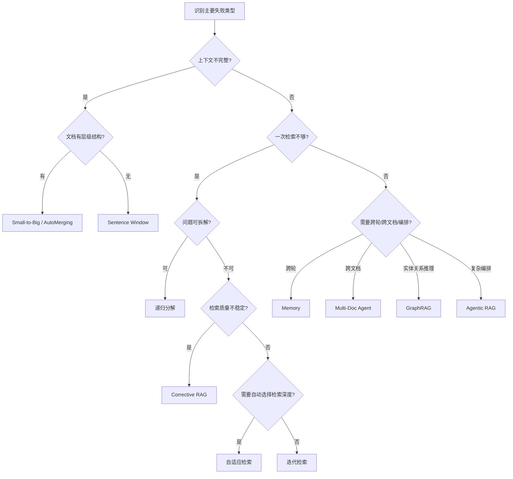

# 4. 选型总结

读完前三节之后，你已经了解了三层增强的方法和各自的适用场景。本节帮你做最后一步决策：面对具体问题时，应该先选哪个方法、怎么组合、什么时候该停。

**说明**：6.1 节只保留**实现 + 同一份 0/1/2 粗评**，避免与「7. 评估」重复铺指标。下文的**速查表**是工程经验向的；若要做**题型路由、多指标门禁、A/B 实验**，请以 `7. 评估` 的体系与量表为准。

## 1) 先判断问题类型

- 如果主要问题是"命中片段太碎、答案上下文不完整"，优先 **上下文增强**。
- 如果主要问题是"一次检索不够、需要多步推理"，优先 **流程增强**。
- 如果主要问题是"多轮会话、多文档协作、工具编排"，优先 **系统增强**。

> 在「上下文增强」里，**文档形态**（连续叙述 / 父子层级 / 多子同父）往往比题面关键词更能决定用 SW 还是 S2B/AM。需要数据支撑的「按题型 SOTA / matrix」请在 `7. 评估` 上跑自己的评估集，不要手抄 6.1 某次小样本数字。

## 2) 方法选择决策流程

## 3) 方法选择速查表

| 方法 | 解决问题 | 主要改善指标 | 实现复杂度 | 延迟成本 | 推荐阶段 |
|---|---|---|---|---|---|
| Sentence Window | 命中句子缺少前后文 | 短答/邻域型问题的可读性、连贯度 | 低 | 低-中 | 无层级时的首选轻量方案 |
| Small-to-Big | 小块命中但信息不全 | 召回到子块、生成时父级完整性 | 中 | 中 | 段落结构清晰、答案跨句分散时 |
| AutoMerging | 多个子块分散命中同父 | 在「整父段」与「子块碎片」间折中 | 中-高 | 中 | 层级深、且**能按语料调阈值**时 |
| 迭代检索 | 首轮回答不完整 | 多轮补全率、最终覆盖率 | 中 | 中-高 | 需要逐步补全时 |
| 递归分解 / Recursive Decomposition | 复杂问题可分解 | 多跳任务完成度 | 中-高 | 高 | 多跳问答时 |
| 查询路由 | 单次请求内选择检索策略或索引配置；生产系统中可扩展到多源路由 | 路由准确率、分支命中质量 | 中 | 低-中 | 6.2 先学检索策略分支，6.3 再扩展到系统级路由 |
| Corrective RAG | 检索结果质量不稳定 | 上下文噪声率、事实性 | 中-高 | 中-高 | 质量优先场景 |
| Self-RAG | 需要动态控制检索 | 自反思决策质量、鲁棒性 | 高 | 高 | 高要求场景 |
| 记忆 | 需要跨轮连续性 | 多轮一致性、指代解析准确率 | 中 | 中 | 会话系统 |
| Multi-Document Agent | 跨文档协作与调度 | 跨源整合能力、任务完成率 | 高 | 高 | 复杂工程 |
| Agentic RAG | 需要规划-执行-反思闭环 | 复杂任务成功率、可恢复性 | 高 | 高 | 高复杂度场景 |
| 自适应检索 | 需要按复杂度选策略 | 策略匹配度、端到端效率 | 中 | 中 | 与查询路由配合 |
| GraphRAG | 需要实体关系推理 | 多跳准确率、全局覆盖度 | 高 | 高 | 知识密集场景 |

- **查询路由适用前提**：问题类型会改变证据策略，例如公式推导题需要小 chunk、高召回和公式邻近文本，概念比较题需要大 chunk 和连续上下文；如果一个通用 retriever 已经能稳定覆盖所有证据，Routing 可能只增加延迟和误路由风险。

## 4) 落地原则

1. **先定位失败类型，再选增强层**；不要把「更复杂的检索后技巧」当作默认。
2. **每引入一个增强都要做对比评估**（准确率、延迟、成本）。粗粒度 0/1/2 裁判受模型随机性影响，生产请配合 `7. 评估` 的细指标与量表，而不是手抄某次小样本表。
3. **AutoMerging 对阈值敏感**：`MERGE_THRESHOLD`、`MIN_CHILD_HITS_FOR_MERGE` 是「整父 vs 子块」的调节阀，换语料要重调或复现实验，不要假设默认可用。
4. 只有在基础方案稳定后，再引入记忆、Agent、自适应检索。

## 5) 推荐组合

1. **低风险增量组合**：`Sentence Window + 查询路由 + 轻量记忆`  
   目标：在可控复杂度下提升可用性；用路由在「需邻域」与「需段落级」等路径间分流。

2. **质量优先组合**：`Small-to-Big 或 AM + Corrective RAG + 递归检索`  
   目标：在复杂、易噪声场景下提升完整性与可纠错能力；AM 需调参与观测。

3. **复杂任务组合**：`Multi-Document Agent + Agentic RAG + Self-RAG`  
   目标：多工具、多文档、长链路任务；必须配套可观测与回退策略。

4. **知识密集组合**：`GraphRAG + Corrective RAG + 自适应检索`  
   目标：实体关系推理、按 query 复杂度选策略。

## 6) 常见误区

- **误区 1：方法越高级，效果一定越好。**  
  实际上高级方法通常同时增加延迟、成本和调参复杂度。

- **误区 2：把「query 改写」和「流程增强」混为一谈。**  
  query 改写是输入优化，流程增强是系统决策优化。

- **误区 3：不做评估直接叠方法。**  
  工程上应先定位瓶颈，再针对性增强；评估口径以 `7. 评估` 为准。

- **误区 4：用 GraphRAG 替代向量检索。**  
  GraphRAG 擅长全局性和关系型问题，但对局部事实查询效率不如向量检索。两者互补，不是替代关系。

- **误区 5：所有题都该上「上下文增强」。**  
  在混合题集上，增强未必平均优于基线定长分块；是否值得上要看证据形态与预算，用评估集数据说话，而不是先验。

- **误区 6：把 6.1 某次 0/1/2 表当终局证据。**  
  教学 notebook 的粗分与样题量会放大随机性；若需对内对外承诺「哪种方法一定更好」，应在 `7. 评估` 的设定下重跑、固定种子或扩大题集，并看细粒度与归因。

> 6.2 的流程增强默认限定在单次请求内；涉及跨请求记忆、多工具、多文档 agent 的编排，放到 6.3 系统增强中讨论。
