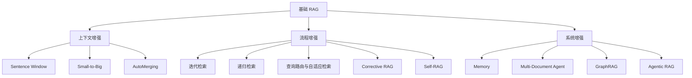

# 第六章：增强阶段

## 基础 RAG 的三个隐含假设

基础 RAG 通常隐含三个假设：一次检索就能覆盖答案所需的全部证据；被召回的片段本身已包含充分上下文；当前问题不依赖历史对话、跨文档关系或系统状态。

当这三个假设不成立时，就需要引入增强策略。

## 当假设不成立时

- 假设 1 失效（命中但上下文不全）→ **上下文增强**：在检索后恢复邻域、父块或层级上下文。
- 假设 2 失效（一次检索不够）→ **流程增强**：让系统多走几步——迭代、递归、路由、质量把关、自反思。
- 假设 3 失效（跨轮/跨文档/状态丢失）→ **系统增强**：引入记忆、多文档路由、知识图谱和 Agent 编排。

## 方法地图

## 本章内容

1. `1. 上下文增强.ipynb` — 解决"检索相关但上下文不全"
2. `2. 流程增强.ipynb` — 解决"一轮流程不够"
3. `3. 系统增强.ipynb` — 解决"多轮/多文档/状态丢失"
4. `4. 选型总结.md` — 方法组合与成本权衡
